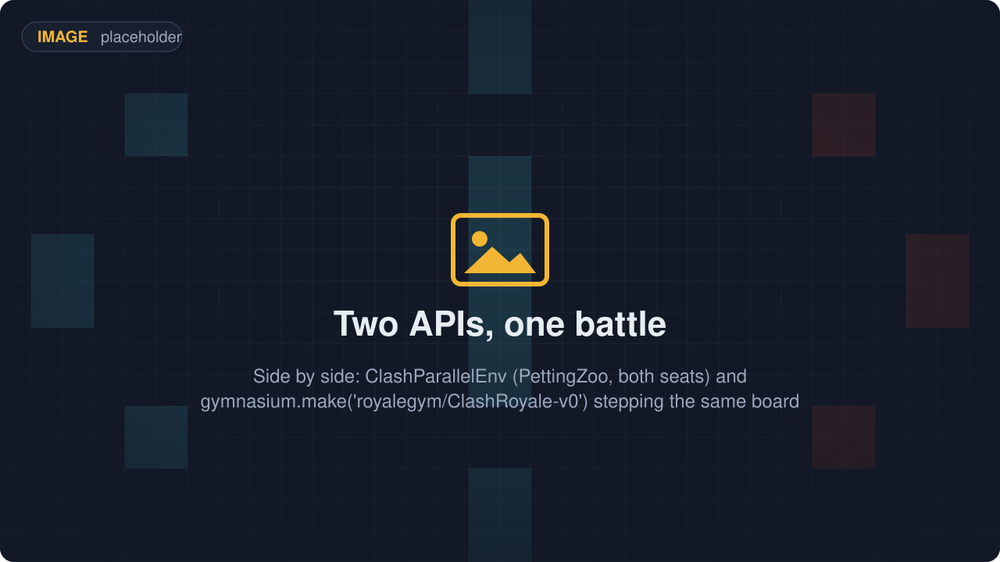
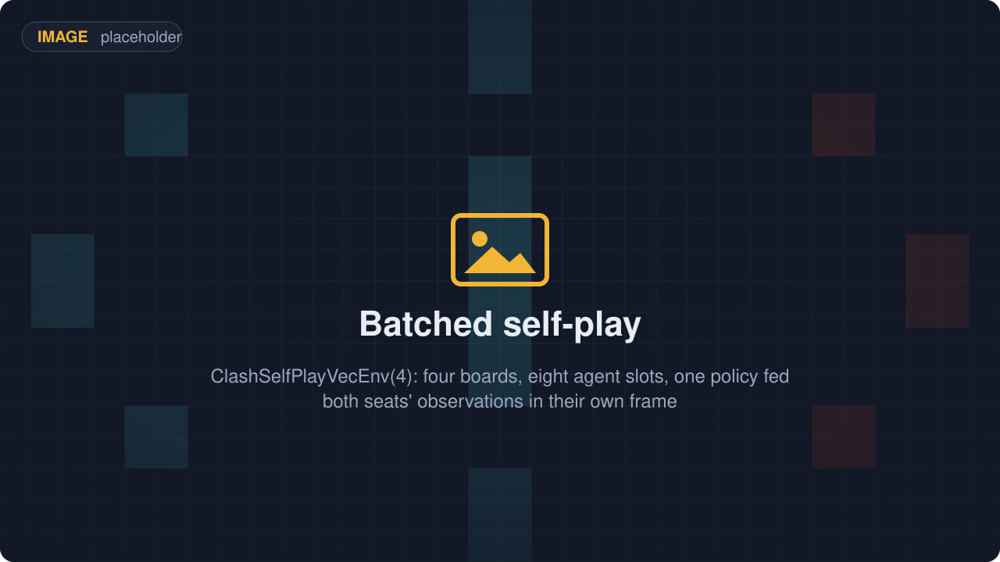
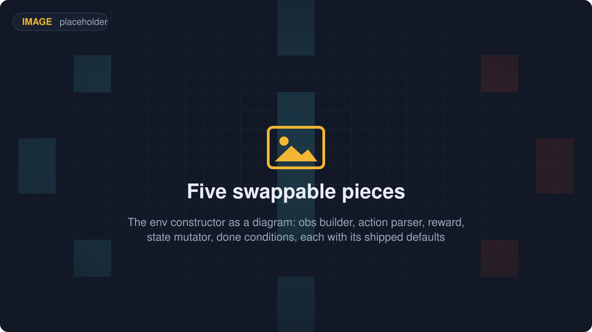
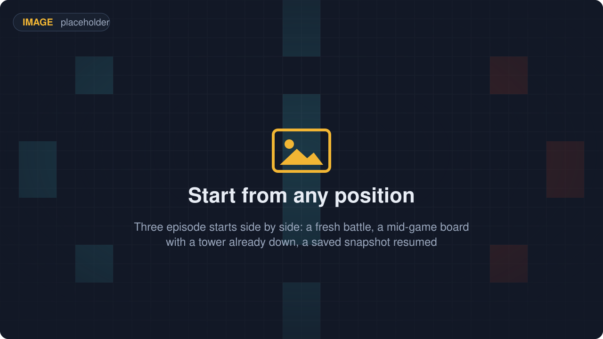
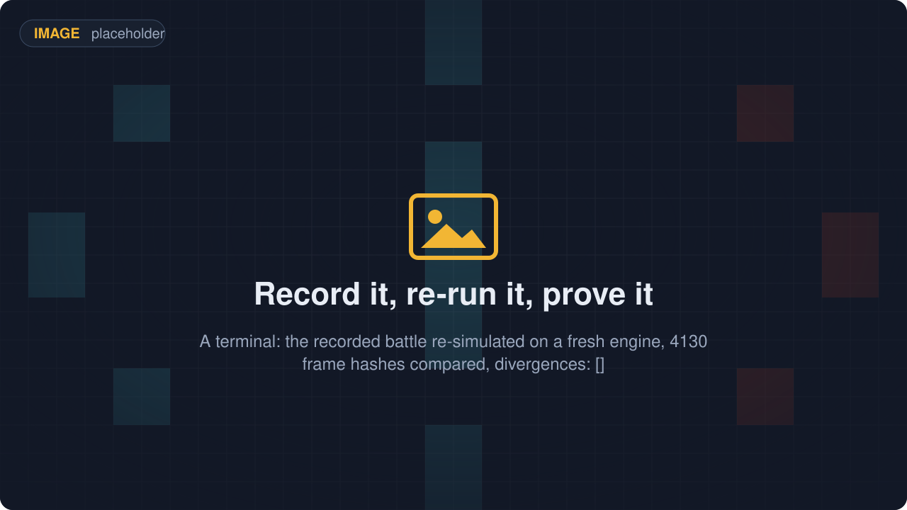
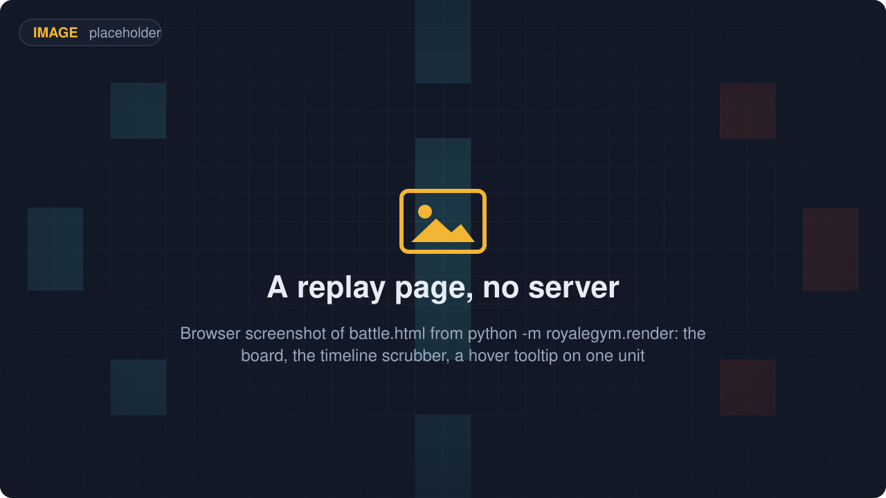
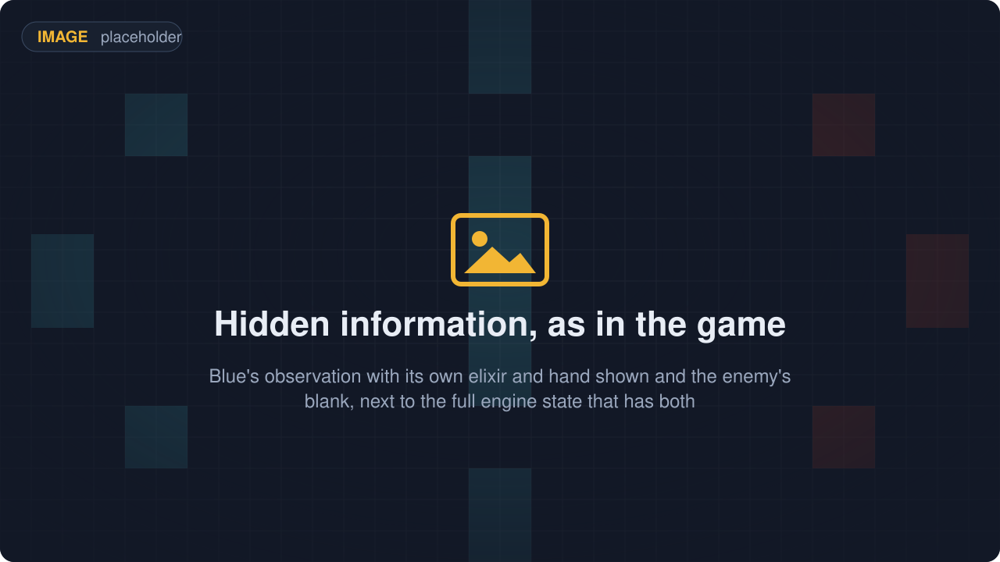

# RoyaleGym

**Reinforcement-learning environments for Clash Royale**: Gymnasium, PettingZoo and batched
self-play envs over a deterministic battle engine, for people who train agents or write bots.

<p align="center"></p>

RoyaleGym is the environment layer of the Royale stack. You write the parts that decide *what*
to train, in Python: what the policy sees, what its actions mean, what it is rewarded for, how
an episode starts and when it ends. The battle itself runs in
[RoyaleSim](https://github.com/RoyaleGym/RoyaleSim), a Rust engine that advances the game in
fixed 50 ms steps (*ticks*, 20 per battle second) and whose rules are calibrated against
recordings of real battles. Two random players finish a whole battle in well under a second,
the policy is told exactly which actions are legal before it picks one, and any battle can be
recorded, replayed and re-verified bit for bit.

## What it does

<table>
  <tr>
    <td width="33%" align="center"><br><b>Two APIs, one battle</b><br><sub>PettingZoo with both players (the two seats) as agents, or Gymnasium for one seat against a scripted opponent.</sub></td>
    <td width="33%" align="center"><br><b>An exact legality mask</b><br><sub>Each observation says which of the 2305 card-and-tile actions are playable now: 691 of 2305 on the first step.</sub></td>
    <td width="33%" align="center"><br><b>Batched self-play</b><br><sub>N battles run as 2N agent slots, so one policy collects both players' experience in a single batch.</sub></td>
  </tr>
  <tr>
    <td width="33%" align="center"><br><b>Five swappable pieces</b><br><sub>Observation, actions, reward, episode start and episode end are each a base class with a shipped default.</sub></td>
    <td width="33%" align="center"><br><b>Start from any position</b><br><sub>A fresh battle, a damaged mid-game, a scripted board or an exact snapshot, mixed by weight as a curriculum.</sub></td>
    <td width="33%" align="center"><br><b>Record it, re-run it, prove it</b><br><sub>A trace (seed, setup, commands, a hash per tick) re-runs on a fresh engine; the battle above: no divergence.</sub></td>
  </tr>
  <tr>
    <td width="33%" align="center"><br><b>A replay page, no server</b><br><sub>A trace becomes one self-contained HTML file you double-click: 3.3 MB and 4130 frames for the battle above.</sub></td>
    <td width="33%" align="center"><br><b>Watch it in the viewer</b><br><sub>RoyaleViser draws a trace in a window or watches a running env live; this is the Try-it battle at tick 4120.</sub></td>
    <td width="33%" align="center"><br><b>Hidden information, as in the game</b><br><sub>The opponent's hand is left out and their elixir is counted from the plays you saw, as a player would; revealing either is opt-in and changes the observation's width, and `ClashParallelEnv.config()` records which was used.</sub></td>
  </tr>
</table>

## Try it

Nothing but `royalegym` and numpy; this is the complete program:

```python
import numpy as np
from royalegym import ClashParallelEnv, RustEngine, RandomLegalOpponent

env = ClashParallelEnv(engine=RustEngine())           # PettingZoo parallel API, both seats
obs, info = env.reset(seed=0)
rng, policy = np.random.default_rng(0), RandomLegalOpponent(noop_prob=0.7)

while env.agents:                                     # one whole battle
    actions = {a: policy.act(obs[a], obs[a]["action_mask"], rng) for a in env.agents}
    obs, reward, terminated, truncated, info = env.step(actions)

s = env.battle_state
print(f"winner {s.winner}  crowns {[p.crowns for p in s.players]}  tick {s.tick}")
```

```
winner 0  crowns [1, 0]  tick 4129
```

Blue (player 0) took one of Red's princess towers at tick 4129, 3:26 into the match and so in
overtime. One env step is half a second of game time (10 ticks), so that was 413 decisions per
player and under a second of wall clock (0.5-0.9 s over four runs on 2026-09-21). Two players
choosing uniformly among their *legal* moves already make a valid opponent, so there is no
bootstrap problem when you plug in a real one. The still under "Watch it in the viewer" above is
this battle at tick 4120.

## With the rest of the stack

<p align="center"></p>

RoyaleGym is the front door of a five-repo project, and the project is named after it. The
shape is the one the Rocket League community settled on with RLGym over RocketSim, trained by
RLGym-PPO and watched in rlviser: a fast deterministic engine
([RoyaleSim](https://github.com/RoyaleGym/RoyaleSim), Rust), an environment API over it (this
repo), a training harness on top ([RoyaleLearn](https://github.com/RoyaleGym/RoyaleLearn)), a
viewer beside them ([RoyaleViser](https://github.com/RoyaleGym/RoyaleViser)), and a client
instrument (RoyaleLive) that records ground-truth traces from the real game, against which the
engine is calibrated. Dependencies run one way, RoyaleLearn to RoyaleGym to RoyaleSim: the engine knows
nothing about rewards or observations, this repo knows nothing about PPO.

| Repo | What it is | To this repo |
|---|---|---|
| [RoyaleSim](https://github.com/RoyaleGym/RoyaleSim) | the battle engine: deterministic, integer-only Rust, its movement rules measured against recordings of real battles | the engine `RustEngine` drives, and the source of the arena and card data this package reads |
| **RoyaleGym** (this repo) | the environment API: observations, actions, rewards; Gymnasium, PettingZoo and self-play envs | package `royalegym`, which composes the five pieces into the envs |
| [RoyaleLearn](https://github.com/RoyaleGym/RoyaleLearn) | the training harness: self-play rollouts, PPO, a ladder of frozen opponents, checkpoints | the consumer of these envs (designed, not yet written) |
| [RoyaleViser](https://github.com/RoyaleGym/RoyaleViser) | the viewer: recordings, engine traces and running environments in its own window | reads this package's traces and its UDP frame stream; the still above is its window |
| RoyaleLive | the client instrument that records ground-truth traces from the real game | nothing directly: its recordings calibrate RoyaleSim, and the fidelity reaches the envs through the engine |

What flows in: the compiled engine module `royalesim`, and RoyaleSim's data files (its table
of calibrated constants and the derived arena and card tables), found at `../RoyaleSim/data`
or wherever `ROYALESIM_DATA_DIR` points. What flows out: traces (`.msgpack` or `.json`) for the
viewer, the replay page and regression tests; one UDP frame per env step for a viewer that is
listening; and env objects for the learner.

```
mkdir Royale && cd Royale
git clone https://github.com/RoyaleGym/RoyaleSim.git
git clone https://github.com/RoyaleGym/RoyaleGym.git
git clone https://github.com/RoyaleGym/RoyaleViser.git
git clone https://github.com/RoyaleGym/RoyaleLearn.git
python -m venv .venv                                                    # Python 3.12
.venv\Scripts\python -m pip install maturin pytest hypothesis ruff
cd RoyaleSim && ..\.venv\Scripts\python tools\extract_arena.py && ..\.venv\Scripts\python tools\extract_cards.py && ..\.venv\Scripts\python tools\extract_globals.py && cd ..   # generates RoyaleSim/data/derived/
cd RoyaleSim && ..\.venv\Scripts\maturin develop --release && cd ..     # builds the engine into the venv (~1 min, ~1.5 GB RAM)
.venv\Scripts\python -m pip install -e RoyaleGym
.venv\Scripts\python -m pip install -e RoyaleViser
.venv\Scripts\python -m pip install -e RoyaleLearn
```

This repo needs everything down to its own `pip install -e RoyaleGym` line; RoyaleViser is
optional (the viewer, and one test that round-trips a frame through it) and RoyaleLearn is not
needed. `royalegym` imports without the engine built: `RustEngine()` then raises an
`ImportError` naming the build command, and `MockEngine`, a pure-Python stand-in engine, runs
the whole API meanwhile. `RustEngine()` also refuses an engine build older than the data files
on disk, so rebuild after either changes.

## Status (2026-09-21)

Working:

- The whole API on both engines: the Gymnasium, PettingZoo and self-play vectorised envs, with
  the legality mask computed independently of the engine and checked against the engine's own
  ruling for every card and position in the tests.
- One policy plays both seats: observations are in the acting player's frame (own king at the
  bottom), so a battle rotated 180 degrees gives the other seat the same view. Its mirror drifts
  apart: 80 of 144 multi-unit deploys diverged ([`docs/architecture.md`](docs/architecture.md)).
- Recording, verification, the replay page and the viewer stream, all off the per-tick path.
- An observation that is fair by construction: what it writes by default is what a person
  watching the match could write down, including a COUNT of the opponent's elixir that is
  exact against the engine's own bar. Anything hidden is opened one field at a time by a
  `Reveal`, which changes the observation's WIDTH rather than filling zeroed slots, and which
  `ClashParallelEnv.config()` records so a checkpoint says whether the policy was cheating
  ([`docs/observation-spec.md`](docs/observation-spec.md)).
- The RLGym v2 names: `StateMutator`, and `TerminationCondition` / `TruncationCondition` so
  that a decided outcome and a time-out are different things. The earlier names still import
  as aliases.

Speed, in plain words: on 2026-09-21 the test suite's throughput report printed 826 env steps
per second on the Rust engine at 10 ticks per step, and about 32 000 engine ticks per second
when the engine is stepped 20 ticks at a time. The gap between the two is Python, which builds
both players' observations and masks on every step; closing it is the first open item below.
Later the same day, dropping the observation's placement-zone channels — the action mask
already states that legality exactly — took the same report from 766 to 953 env steps per second
on the Rust engine and from 475 to 580 on `MockEngine`, measured by alternating the two trees
three times in one session (the absolute numbers move by a third with machine load; the
comparison does not).

Open:

- Default observations and rewards computed inside the engine, with the Python versions kept
  as the override for experiments. Until then training time goes to the observation builder,
  not the battle.
- Nothing trains on these envs out of the box yet: RoyaleLearn is designed but not written. The
  envs expose `action_masks()` in the form sb3-contrib's MaskablePPO expects.
- `MockEngine` is a stand-in, not a second simulator: spells resolve instantly, there are no
  stuns or knockbacks, and cards run at their base level. Anything about game fidelity is
  RoyaleSim's status, not this repo's.

Tests:

```
cd RoyaleGym && ..\.venv\Scripts\python -m pytest -q      # 342 passed, 6 skipped (2026-09-21)
..\.venv\Scripts\python -m ruff check royalegym tests     # All checks passed!
```

Without the engine built the Rust-backed tests skip; an engine build older than the data files
fails them rather than skipping.

**On a checkout that has a private client pack, the two-engine agreement gate does not run.** It
skips, loudly and with its reason, and a skip is not a pass. It means the machine most likely to be
running this suite is the one machine not checking that contract.

Getting it to run takes a data directory without the private pack **and a `royalesim` built in that
checkout**. The compiled engine carries the card table it was built with, so regenerating
`cards.json` or repointing `ROYALESIM_DATA_DIR` moves only `MockEngine`'s half and the tests still
skip. Measured: with a pure 2018 data directory, an extension built from the newer pack still
reported 95 cards with Goblins at 4.

The six SKIPS on 2026-09-21 are a card-table vintage split, and they cannot happen in a public
checkout: only the oldest raw client pack is tracked, so the extractor builds the same table the
mock reads and the two engines agree by construction. This machine has a newer pack and a card
table generated from it, so its two engines are reading different data and every cross-engine
comparison would measure that rather than the engines — `rust_engine.catalogue_vintage_split` says
so and the tests skip on it, naming both vintages. A skip is not a pass.

There are no failures. The five that stood earlier on 2026-09-21 were one missing keyword: the
engine's deploy clamp is measured per side and is deliberately not the rotation of itself, and its
seat-symmetric arm had no way through to Python, so `SymmetricRustEngine` ran the rotation gates
against the asymmetric one and they correctly reported an asymmetry that is real and intended.

Read next: [`docs/architecture.md`](docs/architecture.md) (the layers, the engine contract, the
action space, the module map, the conventions and why each is there),
[`docs/observation-spec.md`](docs/observation-spec.md) (every channel and every vector slot,
its range, and whether it is fair or a reveal),
[`docs/background.md`](docs/background.md) (what is publicly known about the game's rules and
why the engine is measured against recordings rather than reasoned out), then the
[RoyaleSim](https://github.com/RoyaleGym/RoyaleSim) and
[RoyaleViser](https://github.com/RoyaleGym/RoyaleViser) READMEs.

## Community

The project's Discord is the front door for the whole family — bot creators, engine work and training runs:
[**https://discord.gg/4D2BS5JBHP**](https://discord.gg/4D2BS5JBHP)

Issues and pull requests on this repo are welcome too.
