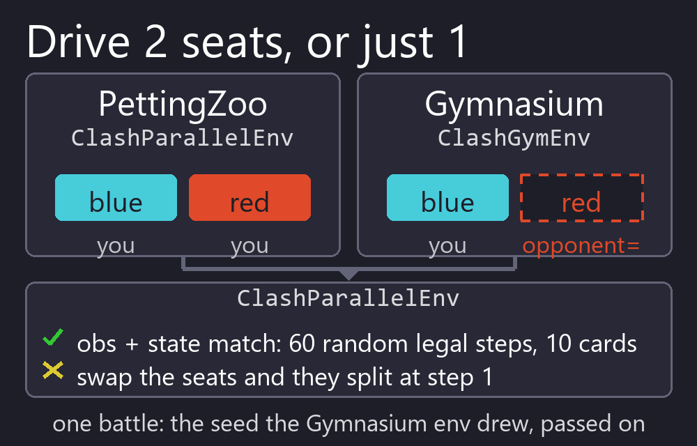
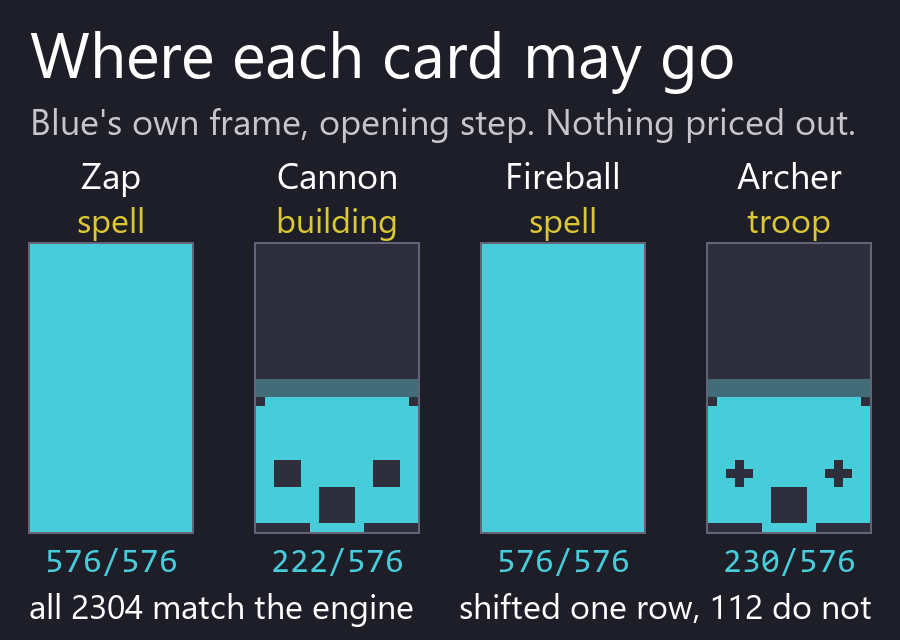
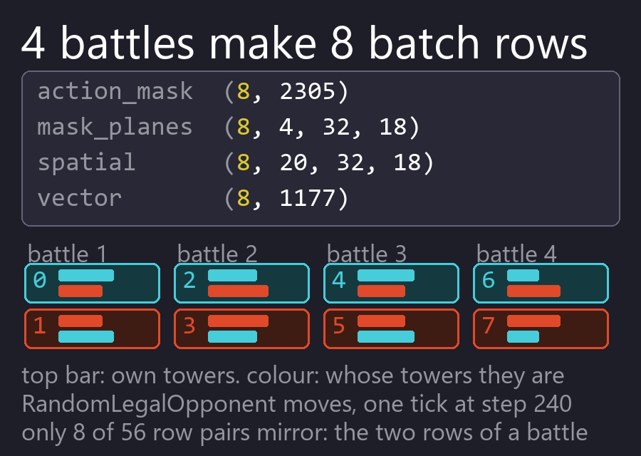
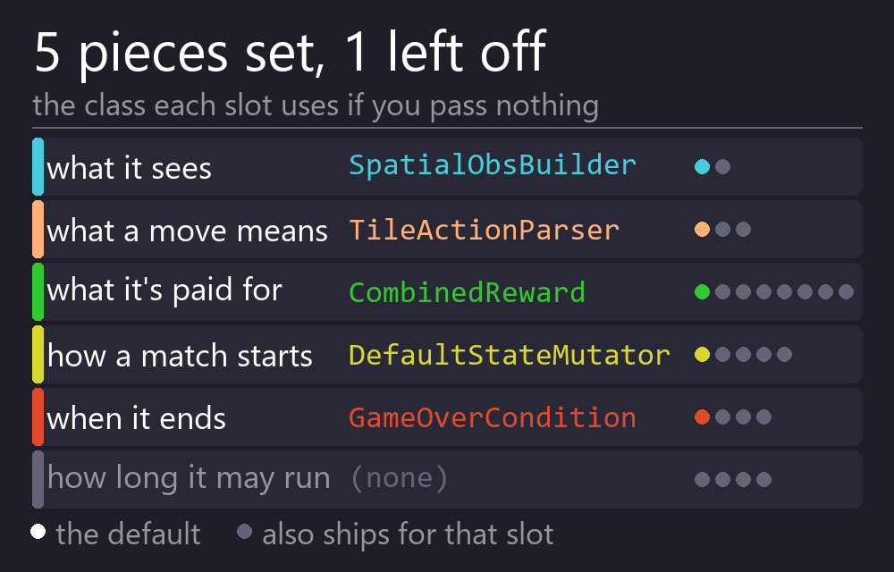
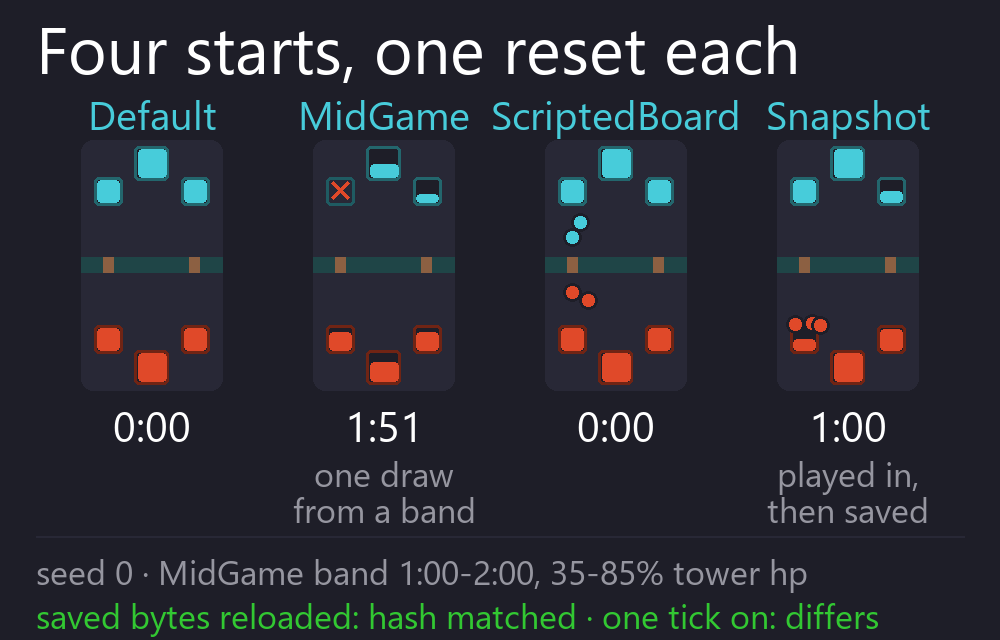
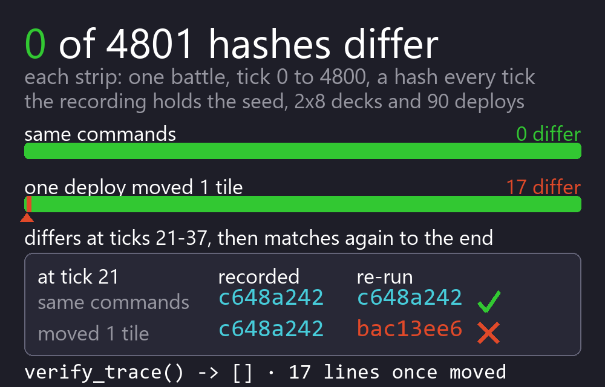
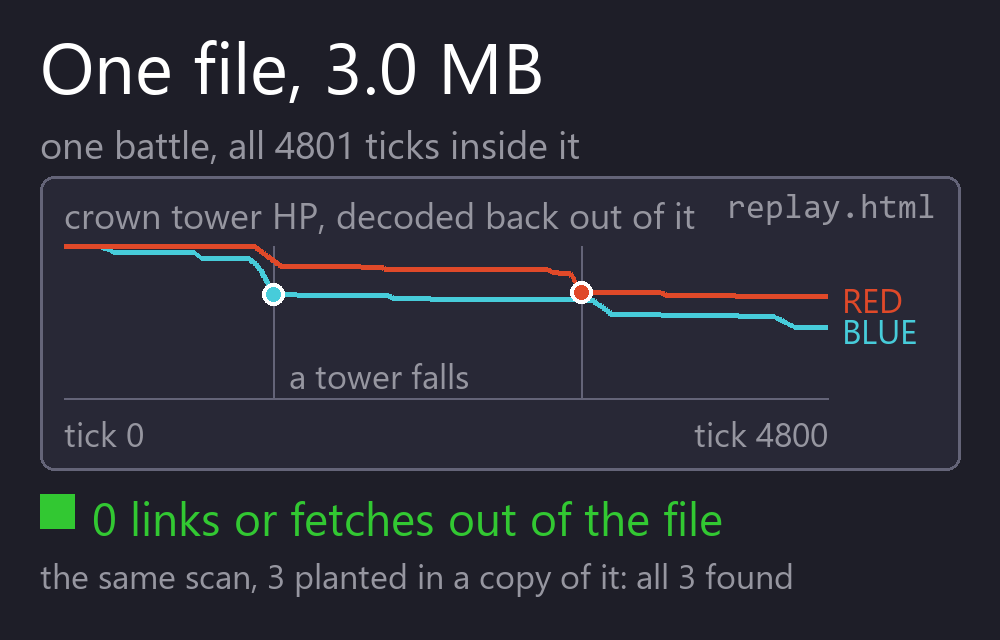
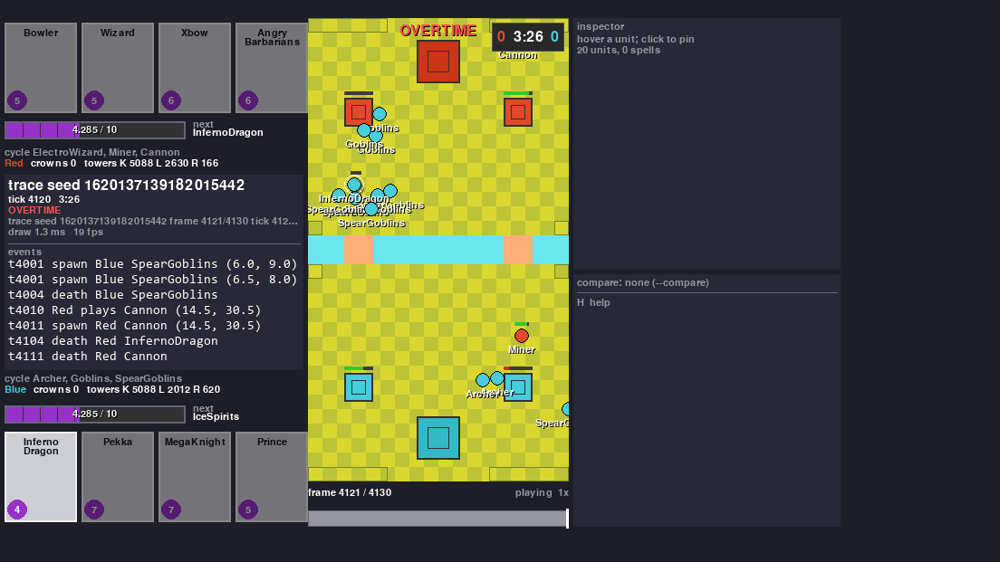
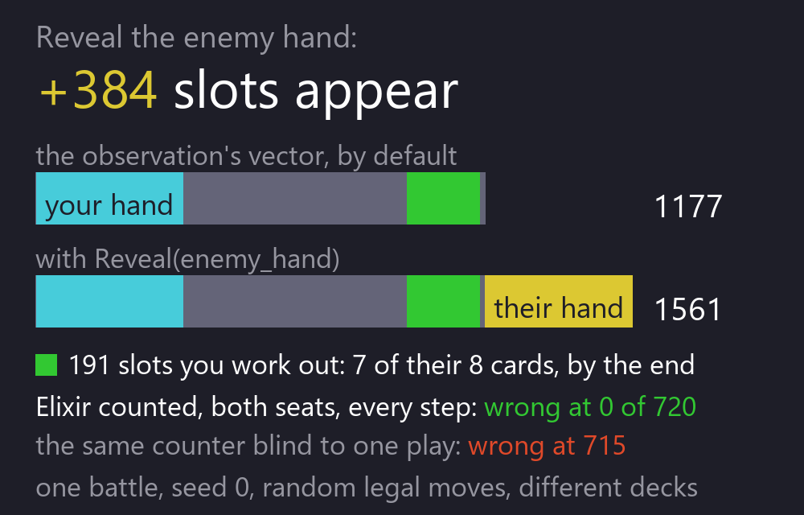
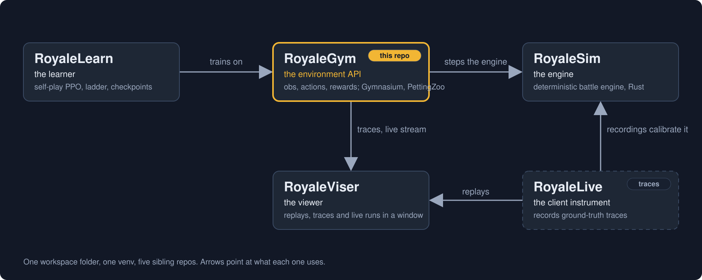

# RoyaleGym

<p align="center">
  
  
  <a href="docs/"></a>
  <a href="https://discord.gg/4D2BS5JBHP"></a>
  
</p>

<p align="center">
  
  
  
  
  
</p>

**Make a Clash Royale bot.** You write a reward function in Python, which says what your bot
should want. The other four pieces already have a version that ships in the box: what your bot
sees, what its moves mean, how a match starts, and when it ends. So does the battle.

<p align="center"></p>

You can replace any of those other pieces too. Each one is a small Python class.

The battle itself runs in [RoyaleSim](https://github.com/RoyaleGym/RoyaleSim), a Rust engine.
It moves the game forward in fixed 50 ms steps. Those steps are called *ticks*, and there are
20 of them per second of game time. Its rules are calibrated against recordings of real
battles.

Three things worth knowing before you start:

- Two random players finish a whole battle in well under a second.
- Your bot is told exactly which moves are legal before it picks one. It never wastes a turn
  on a card it cannot afford or a tile it is not allowed to deploy on.
- Any battle can be recorded and re-run later. The recording carries a hash of the board for
  every tick, and the re-run has to match all of them.

RoyaleGym speaks the two standard Python interfaces for this kind of thing, Gymnasium and
PettingZoo, so the API is the one those libraries' examples use.

New here? The install steps are under [Install](#install).

## What you get

<table>
  <tr>
    <td width="33%" align="center"><br><b>Two APIs, one battle</b><br><sub>PettingZoo when you want both players (the two seats) to be bots. Gymnasium when you want one seat, and the env plays the other.</sub></td>
    <td width="33%" align="center"><br><b>An exact list of legal moves</b><br><sub>Every observation says which of the 2305 card-and-tile moves are playable right now. On the first step of the Try-it battle below, 1623 of the 2305 are, for each player (2026-09-22).</sub></td>
    <td width="33%" align="center"><br><b>One bot plays itself</b><br><sub>N battles run as 2N player slots, so one bot learns from both sides of every match in a single batch.</sub></td>
  </tr>
  <tr>
    <td width="33%" align="center"><br><b>Five swappable pieces</b><br><sub>What the bot sees, what its moves mean, what it is rewarded for, how a match starts, and when it ends. Each is a small class with a default that ships.</sub></td>
    <td width="33%" align="center"><br><b>Start from any position</b><br><sub>A fresh battle, a damaged mid-game, a board you set up by hand, or an exact saved snapshot. Mix them by weight to build a curriculum.</sub></td>
    <td width="33%" align="center"><br><b>Record it, re-run it, prove it</b><br><sub>A recording holds the seed, the setup, the commands and a hash per tick. Re-run it on a fresh engine and every one of those hashes has to come back the same.</sub></td>
  </tr>
  <tr>
    <td width="33%" align="center"><br><b>A replay page, no server</b><br><sub>A recording becomes one self-contained HTML file you double-click. Nothing to install and nothing to run.</sub></td>
    <td width="33%" align="center"><br><b>Watch it in the viewer</b><br><sub>RoyaleViser draws a recording in a window, or watches a running env live. This is a battle in its window.</sub></td>
    <td width="33%" align="center"><br><b>Hidden information, as in the game</b><br><sub>Your bot does not see the opponent's hand. Their elixir is counted from the plays you watched, the way a player counts it. You can turn either one on, which changes the observation's width, and `ClashParallelEnv.config()` records that you did.</sub></td>
  </tr>
</table>

## Try it

Nothing but `royalegym` and numpy; this is the complete program:

```python
import numpy as np
from royalegym import (ClashParallelEnv, DefaultStateMutator, RandomLegalOpponent, RustEngine)

engine = RustEngine()
by_name = {c.name: c.card_id for c in engine.cards()}          # look cards up BY NAME
deck = [by_name[n] for n in ("Knight", "Archer", "Giant", "Minions",
                             "Fireball", "Cannon", "Zap", "Musketeer")]

env = ClashParallelEnv(engine=engine,                          # PettingZoo parallel API, both seats
                       state_mutator=DefaultStateMutator(decks=[deck, deck]))
obs, info = env.reset(seed=0)
rng, policy = np.random.default_rng(0), RandomLegalOpponent(noop_prob=0.7)

while env.agents:                                              # one whole battle
    actions = {a: policy.act(obs[a], obs[a]["action_mask"], rng) for a in env.agents}
    obs, reward, terminated, truncated, info = env.step(actions)

s = env.battle_state
print(f"winner {s.winner}  crowns {[p.crowns for p in s.players]}  tick {s.tick}")
```

```
winner 0  crowns [0, 0]  tick 4800
```

That is a whole match, and a close one (re-run 2026-09-22). Neither side ever finished off a
tower, so the crowns are level at nothing each. Tick 4800 is three minutes plus the full sixty
seconds of overtime, and with the crowns level it came down to damage. Red finished with a
princess tower on 24 hitpoints out of 3052, against Blue's weakest on 1248, so Blue won.

Two random players rarely take a tower, which is the point of the example rather than a flaw in
it. This is the bar your bot starts from.

These eight cards are here so the battle comes out the same on your machine as it did on ours.
They are an example, not a recommendation. All eight are from the 18 whose behaviour is checked
against recordings, which `cards.json` lists under `thin_slice`, so the example leans on the
best-measured part of the engine. Any eight will do. Leave the deck out and each team is dealt a
random eight, which is the default.

One env step is half a second of game time, which is 10 ticks. So each player made 480
decisions. The whole battle takes well under a second of real time, and how far under depends
entirely on what else your machine is doing: four runs on 2026-09-22 with several other jobs
going gave 0.57 to 0.74 s. Treat any timing on this page the same way.

Both players here just pick at random from the moves that are legal. That is already a working
opponent, so you have something to train against from the first minute.

Name the deck, and name it card by card. A card id is only a position in the catalogue, and
positions move between card tables, so the same number is not the same card on every machine.
If you leave the deck out, each side is dealt eight random cards from whatever catalogue your
machine built, and the same seed then gives you a different battle from the one above. Look
cards up by name and your battle matches this one.

There are seven runnable programs in [`examples/`](examples/), in the order they are
worth reading: this battle, one seat with the env playing the other, batched self-play,
writing your own reward, recording and proving a replay, resuming a run where it stopped,
and comparing two bots. The test suite runs all seven and checks each one printed the
thing it exists to show.

If you would rather start from Gymnasium's single-agent API, that is one line, and the id
says which engine you are getting:

```python
import gymnasium as gym
import royalegym                                   # registers the ids

env = gym.make("royalegym/ClashRoyaleRust-v0")     # the real engine, one seat
env = gym.make("royalegym/ClashRoyaleMock-v0")     # the reference implementation
```

`royalegym/ClashRoyale-v0` also exists and takes whatever `engine=` you pass it. Leave that
out and you get the reference implementation with a warning saying so, because a default
that silently decides which engine your results came from is worse than no default. The
reference implementation is a readable Python engine, not the game: different card table,
spells that resolve on the spot instead of travelling, no stuns and no knockback. It is the
right thing to learn the API on and the wrong thing to believe a trained bot against.

## Install

You need this repo and [RoyaleSim](https://github.com/RoyaleGym/RoyaleSim). Here is the whole
thing from an empty folder:

```
mkdir Royale && cd Royale
git clone https://github.com/RoyaleGym/RoyaleSim.git
git clone https://github.com/RoyaleGym/RoyaleGym.git
git clone https://github.com/RoyaleGym/RoyaleViser.git
git clone https://github.com/RoyaleGym/RoyaleLearn.git
python -m venv .venv                                                    # Python 3.12
.venv\Scripts\python -m pip install maturin pytest hypothesis ruff
cd RoyaleSim && ..\.venv\Scripts\python tools\extract_arena.py && ..\.venv\Scripts\python tools\extract_cards.py --vintage 2018 && ..\.venv\Scripts\python tools\extract_cards.py --vintage 2018 --out data\derived\cards.json && ..\.venv\Scripts\python tools\extract_globals.py && cd ..   # generates RoyaleSim/data/derived/
cd RoyaleSim && ..\.venv\Scripts\maturin develop --release && cd ..     # builds the engine into the venv. Give it a few minutes and some free memory.
.venv\Scripts\python -m pip install -e RoyaleGym
.venv\Scripts\python -m pip install -e RoyaleViser
.venv\Scripts\python -m pip install -e RoyaleLearn
.venv\Scripts\python -m pip install -e "RoyaleLearn[torch]"   # only if you want to train; it is a big download
```

You can stop after the `pip install -e RoyaleGym` line. RoyaleViser is optional. It is the
viewer, plus one test that sends a frame through it. RoyaleLearn is not needed at all.

Keep `--vintage 2018` on both `extract_cards.py` runs. Without that flag the extractor asks for
card data that is not shipped with the repo, and a fresh clone does not have it. The 2018 card
table is tracked, so that is the one that works everywhere.

The order of those two lines matters. The build copies the arena and the calibration constants
into the engine, so the data has to exist first. The card table works differently. Every time
you create an engine, it reads `data/derived/cards.json` from the RoyaleSim folder it was
**built in**. Re-running `extract_cards.py` in that folder changes the cards with no rebuild.
Pointing `ROYALESIM_DATA_DIR` at other data does not change which card table the engine reads.
So extract first, build second, and build in the checkout whose data you want.

One hazard if you keep more than one checkout. `maturin develop` installs the engine into the
venv it is run from. Building from a second checkout that shares that venv swaps the engine out
from under the first one. For a second checkout, build a wheel with `maturin build --release`
and install it into a throwaway venv instead.

If the Rust engine will not build on your machine, you can still start. `royalegym` imports
without it. `RustEngine()` then raises an `ImportError` that names the build command, and
`MockEngine`, a plain Python stand-in, runs the whole API in the meantime.

`RustEngine()` also refuses to start if the calibration or arena file on disk differs from the
copy built into the engine. Rebuild after you change either one.

### The five repos

<p align="center"></p>

You only need this repo and RoyaleSim to train a bot. The other three are there when you want
them: a trainer, a viewer, and the recordings the engine is calibrated against. RoyaleGym is
the front door of the five, and the project is named after it.

The layout copies the one the Rocket League community settled on: a fast engine (RocketSim), an
environment API over it (RLGym), a trainer on top (RLGym-PPO) and a viewer beside them
(rlviser). Swap in RoyaleSim, RoyaleGym, RoyaleLearn and RoyaleViser and you have this project.

| Repo | What it is | To this repo |
|---|---|---|
| [RoyaleSim](https://github.com/RoyaleGym/RoyaleSim) | the battle engine. Integer-only Rust. The same seed always gives the same battle. Its movement rules are measured against recordings of real battles | the engine `RustEngine` drives, and where the arena and card data comes from |
| **RoyaleGym** (this repo) | the environment API: what the bot sees, what its moves mean, what it is rewarded for. Gymnasium, PettingZoo and self-play envs | package `royalegym`, which puts the five pieces together into the envs |
| [RoyaleLearn](https://github.com/RoyaleGym/RoyaleLearn) | the training harness: self-play rollouts, PPO, a ladder of frozen opponents, checkpoints | it runs on these envs. Real runs started on 2026-09-22. None has produced a bot yet, and no run so far shows a bot getting better |
| [RoyaleViser](https://github.com/RoyaleGym/RoyaleViser) | the viewer: recordings, engine traces and running environments, drawn in its own window | reads this package's recordings and its live UDP frames. The picture above is its window |
| RoyaleLive | records real matches. It is private | nothing directly. Its recordings are what RoyaleSim is calibrated against, so the accuracy reaches your envs through the engine |

Each layer only talks downward: RoyaleLearn to RoyaleGym to RoyaleSim. The engine knows
nothing about rewards or observations. This repo knows nothing about PPO. That means you can
change a reward without recompiling anything.

What comes in: the compiled engine module `royalesim`, and RoyaleSim's data files, which are
its table of calibrated constants and the arena and card tables built from it. This package
finds them at `../RoyaleSim/data`, or wherever `ROYALESIM_DATA_DIR` points. The engine itself
reads its card table from the checkout it was built in, as [Install](#install) explains.

What goes out: recordings (`.msgpack` or `.json`) for the viewer, the replay page and
regression tests; one UDP frame per env step for a viewer that is listening; and env objects
for the learner.

## Status

<p align="center">
  
  
  
  
</p>

**As of 2026-09-22.** Here is what your clone should give you. That day the four repos were
cloned fresh into an empty folder and set up with the [Install](#install) steps, with a debug
build of the engine. This repo's tests there gave 385 passed, 0 skipped (RoyaleGym at commit
`afb6d1e`). Nothing skipped, so every test ran. The suite has grown since (492 tests at commit
`be58cac`), and has not been re-run from a fresh clone. The release build has not been timed
from a fresh clone yet.

The `pytest` badge is from the project's own machine, which also holds a newer card table that
is not distributed. Six tests skip there because of that table. A clone built with the Install
steps does not have it.

Working:

- The whole API on both engines. That is the Gymnasium, PettingZoo and self-play batched envs.
  The list of legal moves is worked out separately from the engine, and the tests check it
  against the engine's own ruling for every card and every position.
- One bot can play both seats. Everything it sees is drawn from the acting player's point of
  view, with its own king at the bottom, so a battle turned 180 degrees looks the same to the
  other seat. The mirror of that does drift apart: 80 of 144 multi-unit deploys diverged
  ([`docs/architecture.md`](docs/architecture.md)).
- Recording, verification, the replay page and the viewer stream. None of them are in the tick
  loop.
- Six scripted opponents to train against, from one that never plays a card to one that
  saves elixir before committing. `ladder()` returns them. Their order is a measurement,
  and what it measures is smaller than it looks: over a round robin of 40 games a pairing,
  only two orderings hold, and the three middle rungs cannot be told apart. That is
  written down in `royalegym/opponents.py` rather than smoothed over, because a ladder in
  the wrong order tells you a bot improved when it only moved to an easier opponent.
- An answer to "is this bot better than that one". `evaluate` plays the pair on both seats,
  half the games each way, and reports the win rate with a confidence interval, so a 55-45
  result over 100 games reads as "too close to call" rather than as a win. It also counts a
  battle the step limit cut short as unfinished rather than drawn, and reports the two seats
  separately, because a gap between them means part of what you measured was the colour.
- An observation that is fair by default. What your bot sees is what a person watching the
  match could write down, including a COUNT of the opponent's elixir that is exact against the
  engine's own bar. Anything hidden is opened one field at a time with a `Reveal`. Turning one
  on changes the observation's WIDTH instead of filling in zeroed slots, and
  `ClashParallelEnv.config()` records it, so a checkpoint always says whether the bot was
  cheating ([`docs/observation-spec.md`](docs/observation-spec.md)).
- The RLGym v2 names, so the vocabulary matches what you already know: `StateMutator`, and
  `TerminationCondition` / `TruncationCondition` so that a settled result and a time-out are
  different things. The earlier names still import as aliases.

**Speed: the Rust engine runs 1.16 to 1.38 times the pure-Python stand-in, measured by
alternating the two inside one process.** That ratio is the durable number here, because
whatever the machine is doing it does to both arms. An env step is one decision for each
player, covering half a second of game time.

The absolute rate is not durable and you should not plan against it. The same report on one
laptop has printed 953, 957, 859 and 1812 env steps per second depending on the hour and
what else was running.

How that was measured, and the rest of the numbers:

- On 2026-09-21 the test suite's throughput report printed 826 env steps per second on the
  Rust engine at 10 ticks per step. The same report printed about 32 000 engine ticks per
  second when the engine is stepped 20 ticks at a time.
- The gap between those two figures is Python. Python builds both players' observations and
  their legal-move lists on every step. Closing that gap is the first open item below.
- Later the same day we dropped the placement-zone channels from the observation. The
  legal-move list already states that exactly, so the channels were saying it twice. The same
  report went from 766 to 953 env steps per second on the Rust engine, and from 475 to 580 on
  `MockEngine`.
- That was measured by alternating the two trees three times in one session. The absolute
  numbers move by a third depending on what else the machine is doing. The comparison between
  them does not.
- The same report on 2026-09-22, with five other jobs running on the machine, printed 957 env
  steps per second on the Rust engine.

Open:

- Default observations and rewards should be computed inside the engine, with the Python
  versions kept as the override for experiments. Until that is done, training time goes to
  building observations rather than to the battle.
- RoyaleLearn runs on these envs. Its first real runs were on 2026-09-22. None has produced a bot
  yet, and a defect in that harness, open on that date, means no run so far shows a bot getting
  better. That is their side of the seam, not these envs, but it is the honest state of the only
  trainer that uses them. The envs also expose `action_masks()` in the form
  sb3-contrib's MaskablePPO expects, if you would rather bring your own trainer.
- `MockEngine` is a stand-in, not a second simulator. Spells resolve instantly, there are no
  stuns or knockbacks, and cards run at their base level. Anything about how faithful the game
  itself is belongs to RoyaleSim's status, not this repo's.

Tests:

```
cd RoyaleGym && ..\.venv\Scripts\python -m pytest -q
..\.venv\Scripts\python -m ruff check royalegym tests examples
```

Without the engine built, the Rust-backed tests skip. An engine built from a different
calibration or arena file than the one on disk fails them instead of skipping.

With the whole Install recipe done, expect no skips. A few tests do skip if Node.js is not on
your PATH or RoyaleViser is not installed. Add `-rs` to the pytest line to read the reason for
each skip. A skip is not a pass.
[Troubleshooting](docs/site/pages/troubleshooting.md#6-tests-that-skip-instead-of-failing)
says which skips are expected and why.

Read next:

- [`examples/`](examples/) for seven programs that run, starting with one battle and ending
  with comparing two bots.
- The documentation site, [royalegym.github.io/RoyaleGym](https://royalegym.github.io/RoyaleGym/),
  which is longer than anything here. The same pages are in this repo under
  [`docs/site/pages/`](docs/site/pages/), and you can build the site yourself with
  `pip install -e "RoyaleGym[docs]"` and `mkdocs serve` from `docs/site`.
  [Your first bot](docs/site/pages/first-bot.md) walks a custom policy from
  nothing to beating the random opponent, and there are pages on
  [installing](docs/site/pages/install.md),
  [writing a reward](docs/site/pages/rewards.md),
  [observations and actions](docs/site/pages/observations-and-actions.md),
  [how accurate the engine is](docs/site/pages/accuracy.md) and
  [what to do when something breaks](docs/site/pages/troubleshooting.md).
- [`docs/architecture.md`](docs/architecture.md) for the layers, the engine contract, the
  action space, the module map, and why each convention is there.
- [`docs/observation-spec.md`](docs/observation-spec.md) for every channel and every vector
  slot, its range, and whether it is fair or a reveal.
- [`docs/background.md`](docs/background.md) for what is publicly known about the game's rules,
  and why the engine is measured against recordings rather than reasoned out.
- Then the [RoyaleSim](https://github.com/RoyaleGym/RoyaleSim) and
  [RoyaleViser](https://github.com/RoyaleGym/RoyaleViser) READMEs.

## Community

The project's Discord is the front door for the whole family: bot creators, engine work and
training runs.

<p align="center">
  <a href="https://discord.gg/4D2BS5JBHP"></a>
</p>

Issues and pull requests on this repo are welcome too.
