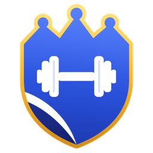

<p align="center"></p>

<h1 align="center">RoyaleGym</h1>

<p align="center"><a href="https://github.com/RoyaleGym/RoyaleGym/actions/workflows/suite.yml"></a>   <a href="https://royalegym.github.io/RoyaleGym/"></a> <a href="https://discord.gg/8BxaHHVT2u"></a> </p>

<p align="center">   </p>

**Make a Clash Royale bot in Python.** You write what your bot should want; this gives it the
battles, what it sees, the moves it can make, and a trainer. For a bot that plays like a person,
start by cloning human players from real games
([Cloning a Bot](https://royalegym.github.io/RoyaleGym/clash-royale/cloning-a-bot/)): a bot that
learns only by trial and error, from nothing, doesn't get far.

<p align="center"></p>

## Install

    pip install "royalegym[all]"

Python 3.12. No Rust, no game files. On Windows with an NVIDIA card, install PyTorch first
([Install](https://royalegym.github.io/RoyaleGym/install/), step 4).

## Try it

```python
from royalegym import make_env, play_battle

battle = play_battle(make_env(), blue="random", red="random", save_to="first_battle.msgpack")
print("winner", battle.winner, "crowns", battle.crowns)
```

Save it as `first_battle.py` and run `python first_battle.py` (a few seconds). `winner` is 0 for
Blue, 1 for Red and 2 for a draw. Then watch it: `royaleviser first_battle.msgpack`. To train a bot,
follow the [Quick Start](https://royalegym.github.io/RoyaleGym/quickstart/): it gives you `quickstart.py`.

## Next

- Quick Start, guides and FAQ: [the docs](https://royalegym.github.io/RoyaleGym/)
- A bot that copies human players: [Cloning a Bot](https://royalegym.github.io/RoyaleGym/clash-royale/cloning-a-bot/)
- How it works inside (Advanced): [architecture](https://royalegym.github.io/RoyaleGym/repos/royalegym/architecture/)
- Questions: [Discord](https://discord.gg/8BxaHHVT2u)

MIT licensed. See [LICENSE](LICENSE).
