# RoyaleGym

<p align="center">
  
  
  <a href="../docs/"></a>
  <a href="https://discord.gg/4D2BS5JBHP"></a>
  
</p>

<p align="center">
  
  
  
  
  
</p>

**Make a Clash Royale bot.** You write a reward function in Python, which says what your bot
should want. The other four pieces already have a version that ships in the box: what your bot
sees, what its moves mean, how a match starts, and when it ends. So does the battle.

<p align="center">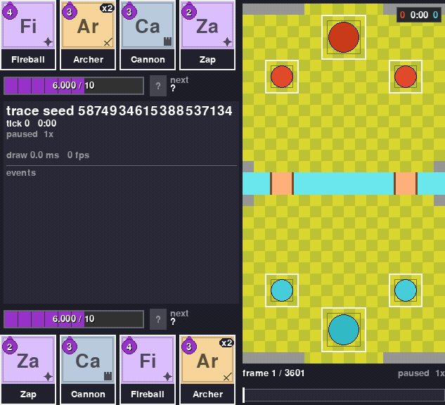</p>

You can replace any of those other pieces too. Each one is a small Python class.

The battle itself runs in [RoyaleSim](https://github.com/RoyaleGym/RoyaleSim), a Rust engine.
It moves the game forward in fixed 50 ms steps. Those steps are called *ticks*, and there are
20 of them per second of game time. Its rules are calibrated against recordings of real
battles.

Three things worth knowing before you start:

- Two random players finish a whole battle in well under a second.
- Your bot is told exactly which moves are legal before it picks one. It never wastes a turn
  on a card it cannot afford or a tile it is not allowed to deploy on.
- Any battle can be recorded and re-run later. The recording carries a hash of the board for
  every tick, and the re-run has to match all of them.

RoyaleGym speaks the two standard Python interfaces for this kind of thing, Gymnasium and
PettingZoo, so the API is the one those libraries' examples use.

New here? The install steps are under [Install](#install).

## What you get

<table>
  <tr>
    <td width="33%" align="center">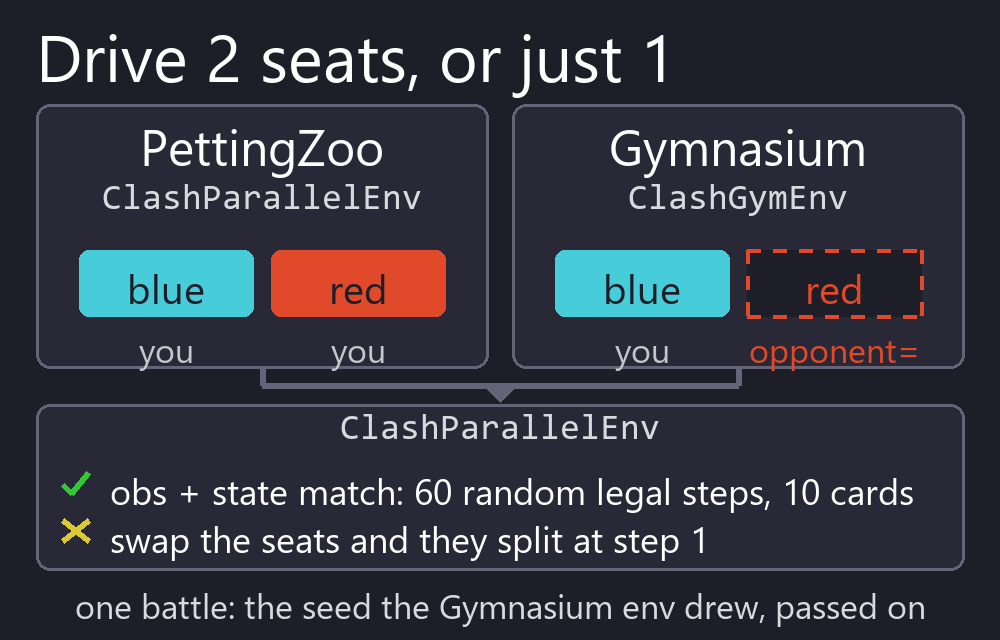<br><b>Two APIs, one battle</b><br><sub>PettingZoo when you want both players (the two seats) to be bots. Gymnasium when you want one seat, and the env plays the other.</sub></td>
    <td width="33%" align="center">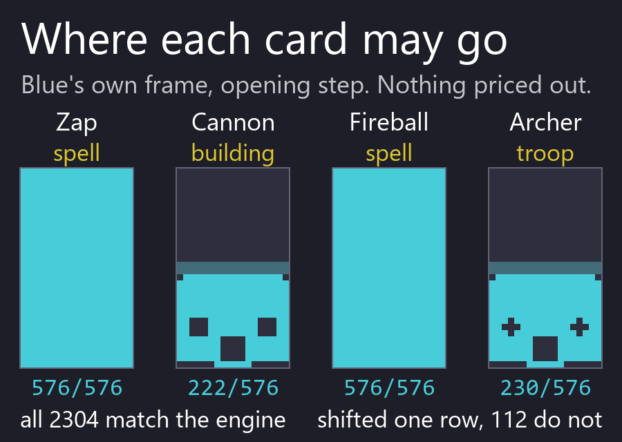<br><b>An exact list of legal moves</b><br><sub>Every observation says which of the 2305 card-and-tile moves are playable right now. In the Try-it battle below, 1640 of the 2305 are once play opens on step 9. Before that only waiting is legal, because a match refuses every deploy for its first 90 ticks.</sub></td>
    <td width="33%" align="center">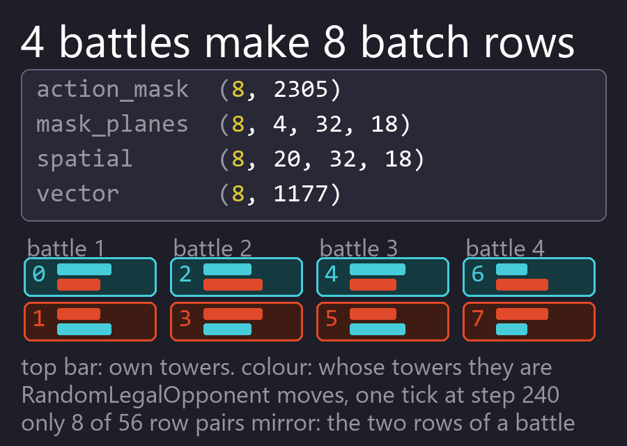<br><b>One bot plays itself</b><br><sub>N battles run as 2N player slots, so one bot learns from both sides of every match in a single batch.</sub></td>
  </tr>
  <tr>
    <td width="33%" align="center">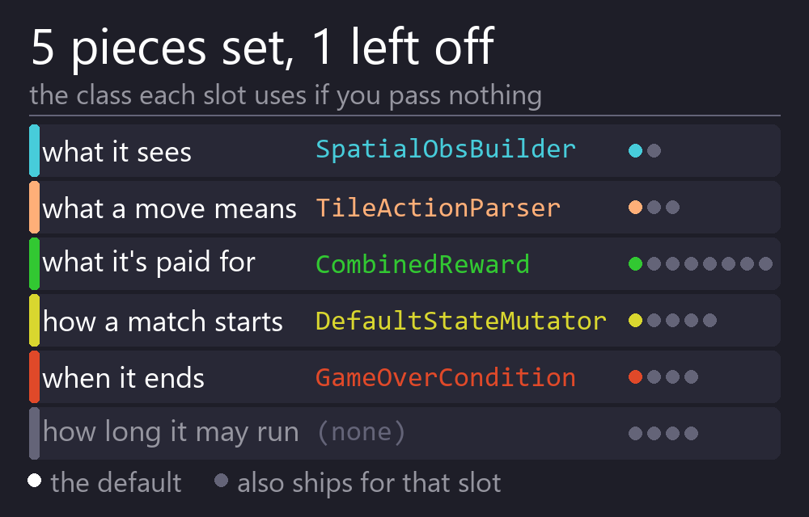<br><b>Five swappable pieces</b><br><sub>What the bot sees, what its moves mean, what it is rewarded for, how a match starts, and when it ends. Each is a small class with a default that ships.</sub></td>
    <td width="33%" align="center">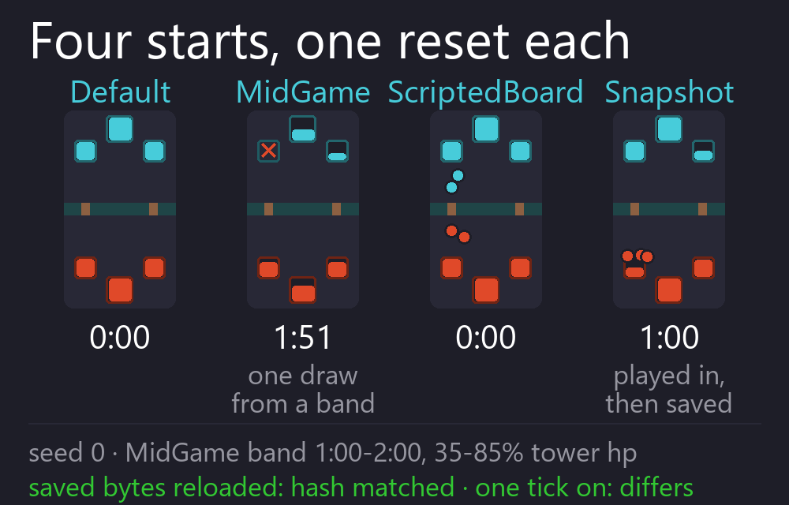<br><b>Start from any position</b><br><sub>A fresh battle, a damaged mid-game, a board you set up by hand, or an exact saved snapshot. Mix them by weight to build a curriculum.</sub></td>
    <td width="33%" align="center">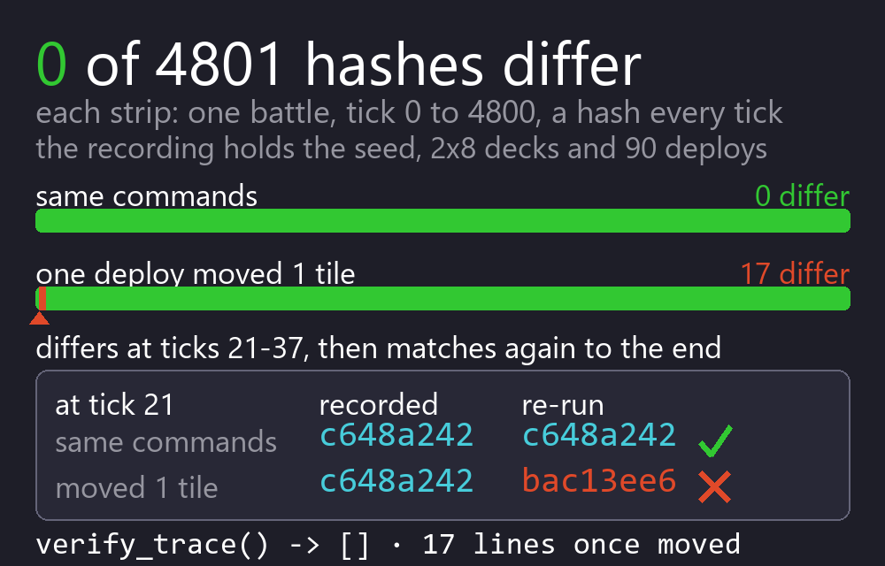<br><b>Record it, re-run it, prove it</b><br><sub>A recording holds the seed, the setup, the commands and a hash per tick. Re-run it on a fresh engine and every one of those hashes has to come back the same.</sub></td>
  </tr>
  <tr>
    <td width="33%" align="center">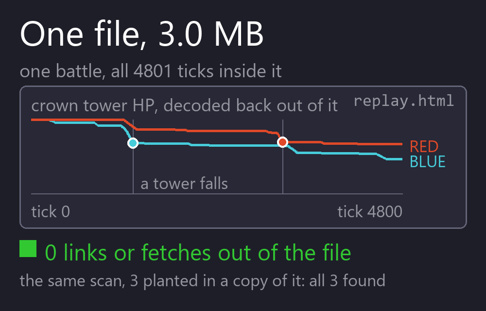<br><b>A replay page, no server</b><br><sub>A recording becomes one self-contained HTML file you double-click. Nothing to install and nothing to run.</sub></td>
    <td width="33%" align="center">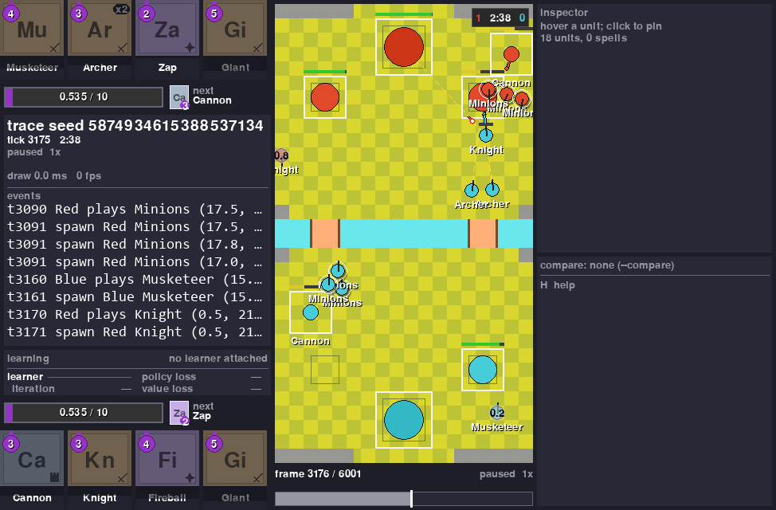<br><b>Watch it in the viewer</b><br><sub>RoyaleViser draws a recording in a window, or watches a running env live. This is a battle in its window.</sub></td>
    <td width="33%" align="center">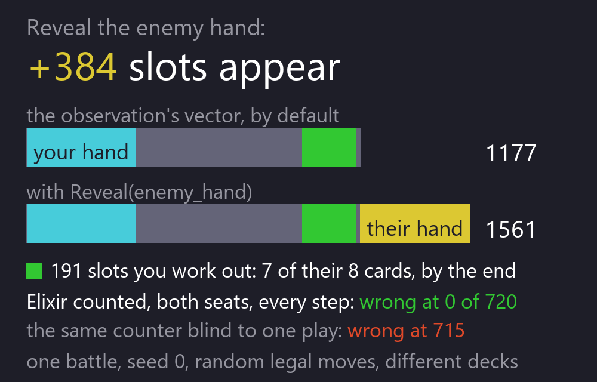<br><b>Hidden information, as in the game</b><br><sub>Your bot does not see the opponent's hand. Their elixir is counted from the plays you watched, the way a player counts it. You can turn either one on, which changes the observation's width, and `ClashParallelEnv.config()` records that you did.</sub></td>
  </tr>
</table>

## Try it

Nothing but `royalegym` and numpy; this is the complete program:

```python
import numpy as np
from royalegym import (ClashParallelEnv, DefaultStateMutator, RandomLegalOpponent, RustEngine)

engine = RustEngine()
by_name = {c.name: c.card_id for c in engine.cards()}          # look cards up BY NAME
deck = [by_name[n] for n in ("Knight", "Archer", "Giant", "Minions",
                             "Fireball", "Cannon", "Zap", "Musketeer")]

env = ClashParallelEnv(engine=engine,                          # PettingZoo parallel API, both seats
                       state_mutator=DefaultStateMutator(decks=[deck, deck]))
obs, info = env.reset(seed=0)
rng, policy = np.random.default_rng(0), RandomLegalOpponent(noop_prob=0.7)

while env.agents:                                              # one whole battle
    actions = {a: policy.act(obs[a], obs[a]["action_mask"], rng) for a in env.agents}
    obs, reward, terminated, truncated, info = env.step(actions)

s = env.battle_state
print(f"winner {s.winner}  crowns {[p.crowns for p in s.players]}  tick {s.tick}")
```

```
winner 1  crowns [1, 1]  tick 6000
```

That is a whole match, re-run 2026-09-28 on engine build `bb6797d83bdf3031` with the **15.535 card
table**, which the Install steps below put at `cards.json`. It was one crown each when the three
minutes ran out: Red took Blue's left princess tower at tick 1800 and Blue took Red's left one at
tick 3580. Nobody scored in overtime, so at tick 6000 a tiebreak decided it, and Red won: Blue's
weakest standing tower had less health left.

Measured on the project's desktop, not on a clean runner, building the engine from
**RoyaleSim `0d0ccd6`**. The compiled engine is `engine_binary_sha256` `2c3c052ed85c1f5e`.

**This result has moved six times, and each move is traced to one engine rule.** All six were
found the same way: switch that one rule back, run this exact program, and get the previous result
exactly.

- On 2026-09-23 it went from `winner 0  crowns [2, 1]  tick 3600` to `winner 0  crowns [1, 0]  tick
  3755`, when a tower whose target dies started carrying its attack timing on to the next target
  instead of starting again (`combat.RETARGET_PROGRESS`).
- On 2026-09-24 it moved to `winner 1  crowns [0, 1]  tick 3600`, when attacking units started
  being pushed apart by their neighbours, as recordings of real matches show
  (`movement.ATTACKING_UNIT_MOVEMENT`).
- Later on 2026-09-24 it moved to `winner 0  crowns [1, 0]  tick 3728`, when a walking unit
  stopped turning aside for a unit next to it that is still deploying and faces the same way, again
  as recordings of real matches show (`movement.DEPLOYING_HEADING`).
- On 2026-09-27 it moved to `winner 0  crowns [1, 1]  tick 6000`, when a troop tapped on its own
  crown tower started being moved off it and the king's no-deploy block started opening on its far
  edges, both as measured on the client (`placement.TROOP_TOWER_TAPS`). With that rule switched
  back, that build printed `winner 0  crowns [1, 0]  tick 3728` exactly.
- Later on 2026-09-27 it moved to `winner 1  crowns [0, 1]  tick 3600`, when a unit that has just
  killed its target stopped carrying its swing over to a new target out of its reach, as measured
  on the client (`combat.CORPSE_SWITCH_REACH`). With that rule switched back, that build printed
  `winner 0  crowns [1, 1]  tick 6000` exactly; switching back any one of the other nine rules that
  changed with it did not.
- On 2026-09-28 it moved to the result above, when a troop tapped on one of its own buildings
  started being moved off it as off a crown tower, as measured on the client
  (`placement.TROOP_BUILDING_TAPS`). With that rule switched back, this build prints `winner 1
  crowns [0, 1]  tick 3600` exactly; switching back any one of the other four placement rules
  that changed with it does not.

**The RoyaleSim commit is written here because the digest cannot supply it.** `build_digest` hashes
the calibration values and the arena compiled into the extension; it has no access to the Rust at
all, so two engines with different code and identical calibration share one. That cuts both ways: a
future engine could change behaviour, keep this digest, and be compared against this battle as
though nothing had moved. The commit beside it is what closes that gap, and `engine_binary_sha256`
is the stamp that identifies the compiled artefact if you need to tell two builds apart directly.

**Two stamps, because two things move this output independently.** The build is one, as above.
The card table is the other, and it is not a smaller effect: at an earlier build,
`d6715210f21ca0c3`, this program chose a different winner on the 2018 table than on the 15.535 one.
So if your result differs, the digest and the vintage together tell you which of the two moved,
rather than leaving you to suspect your install. `RustEngine().config()` returns yours as a
dict; print it to read `build_digest` and `cards_vintage`. A different digest with the same
printed line is fine.

Both players are picking at random from the legal moves, and each of them still took a tower. That
is the bar your bot starts from.

These eight cards are here so the battle comes out the same on your machine as it did on ours.
They are an example, not a recommendation. All eight are from the 18 whose behaviour is checked
against recordings, which `cards.json` lists under `thin_slice`, so the example leans on the
best-measured part of the engine. Any eight will do. Leave the deck out and each team is dealt a
random eight, which is the default.

One env step is half a second of game time, which is 10 ticks. The battle ended at tick 6000,
the full five minutes, so each player made 600 decisions. The whole battle takes under a second of real time, and how far under depends
entirely on what else your machine is doing: four runs on 2026-09-22, on a laptop with 8 GB of
memory and several other jobs going, gave 0.57 to 0.74 s. Treat any timing on this page the same way.

Both players here just pick at random from the moves that are legal. That is already a working
opponent, so you have something to train against from the first minute.

Name the deck, and name it card by card. A card id is only a position in the catalogue, and
positions move between card tables, so the same number is not the same card on every machine.
If you leave the deck out, each side is dealt eight random cards from whatever catalogue your
machine built, and the same seed then gives you a different battle from the one above. Look
cards up by name and your battle matches this one.

There are seven numbered programs in [`examples/`](../examples/), in the order they are
worth reading: this battle, one seat with the env playing the other, batched self-play,
writing your own reward, recording and proving a replay, resuming a run where it stopped,
and comparing two bots. An eighth, `measure_building_relocation.py`, is a measurement
rather than a lesson: it counts how often a building does not land on the tile that was
tapped. The test suite runs all eight and checks each one printed the thing it exists to
show.

If you would rather start from Gymnasium's single-agent API, that is one line, and the id
says which engine you are getting:

```python
import gymnasium as gym
import royalegym                                   # registers the ids

env = gym.make("royalegym/ClashRoyaleRust-v0")     # the real engine, one seat
env = gym.make("royalegym/ClashRoyaleMock-v0")     # the reference implementation
```

`royalegym/ClashRoyale-v0` also exists and takes whatever `engine=` you pass it. Leave that
out and you get the reference implementation with a warning saying so, because a default
that silently decides which engine your results came from is worse than no default. The
reference implementation is a readable Python engine, not the game: different card table,
spells that resolve on the spot instead of travelling, no stuns and no knockback. It is the
right thing to learn the API on and the wrong thing to believe a trained bot against.

## Install

You need this repo and [RoyaleSim](https://github.com/RoyaleGym/RoyaleSim).

Before you start you need three things, and the build fails late and unhelpfully without the
third: **Python 3.12 or newer**, **git**, and a **Rust toolchain** from
[rustup.rs](https://rustup.rs). On Windows, rustup will offer to install the Microsoft C++ build
tools; say yes, because the engine cannot link without them. The Rust build folder was 100 MB
after the build, and about 760 MB after also running the Rust tests and clippy (4-CPU Linux,
2026-09-27).

The commands below are for **Windows**, one per line. Paste them one at a time rather than as a
block: Windows PowerShell cannot chain commands with `&&`, and a pasted comment is not a comment
in `cmd`. On macOS and Linux the interpreter is `.venv/bin/python`, paths take forward slashes,
`cp` replaces `Copy-Item`, and `export X=Y` goes where Windows sets a variable. The
[install page](../docs/site/pages/install.md) has those commands in full.

```
mkdir Royale
cd Royale
git clone https://github.com/RoyaleGym/RoyaleSim.git
git clone https://github.com/RoyaleGym/RoyaleGym.git
git clone https://github.com/RoyaleGym/RoyaleViser.git
git clone https://github.com/RoyaleGym/RoyaleLearn.git
py -3.12 -m venv .venv
.venv\Scripts\python --version
.venv\Scripts\python -m pip install maturin pytest hypothesis ruff numpy msgspec
```

The venv must be Python 3.12 or newer, so the `--version` line has to print 3.12 or newer before
you build. On macOS and Linux, create it with `python3.12 -m venv .venv` and check it with
`.venv/bin/python --version`. An older Python compiles the engine for several minutes and is only
refused at the install step. If `python --version` already prints 3.12 or newer, `python -m venv
.venv` works too.

Optional: [RoyaleImitate](https://github.com/RoyaleGym/RoyaleImitate) adds imitation learning to
RoyaleLearn. Its README has its own two install lines.

Now generate the card and arena data the engine reads. A clone carries only `cards-15.535.json`
in `RoyaleSim/data/derived/`; these lines generate the rest, and the engine cannot start without
them:

```
cd RoyaleSim
..\.venv\Scripts\python tools\extract_arena.py
..\.venv\Scripts\python tools\extract_cards.py --vintage 2018
Copy-Item data\derived\cards-15.535.json data\derived\cards.json
..\.venv\Scripts\python tools\extract_globals.py
```

Then build the engine, from that same folder. From a fresh clone it took 163 seconds and about
1 GB of memory on a 4-CPU Linux machine on 2026-09-27. It can go quiet for a minute or more on
the engine itself; let it finish:

```
..\.venv\Scripts\maturin develop --release
cd ..
```

Then install the Python packages:

```
.venv\Scripts\python -m pip install -e RoyaleGym
.venv\Scripts\python -m pip install -e RoyaleViser
.venv\Scripts\python -m pip install -e RoyaleLearn
```

Only if you want to train, and it is a multi-GB download. No NVIDIA GPU? Install CPU torch
first. On a 4-CPU Linux machine with no GPU, on 2026-09-27, the default torch download pulled
about 5 GB of CUDA wheels:

```
.venv\Scripts\python -m pip install torch --index-url https://download.pytorch.org/whl/cpu
```

Then the training extra:

```
.venv\Scripts\python -m pip install -e "RoyaleLearn[torch]"
```

On macOS and Linux both lines start `.venv/bin/python` instead.

You can stop after the `pip install -e RoyaleGym` line. RoyaleViser is optional. It is the
viewer. Four tests in this repo's suite need it, and they skip without it; pytest reports them
as two skips, because three of them share one file. RoyaleLearn is the trainer. Nothing here
needs it except the documentation site build (see Read next, below).

Two card tables get written and only one of them is the one the engine loads.
`cards-15.535.json` is committed to RoyaleSim, so the copy line puts the current game's table at
`cards.json`, which is what the engine reads. That is the table this README's numbers are measured
on and the one you want.

`extract_cards.py --vintage 2018` builds the older table beside it, under its own name. Keep the
`--vintage 2018` flag on that line: without it the extractor asks for card data that is not shipped
with the repo. The 2018 table is not left over - it is what the cross-engine comparisons use, and
that is the next paragraph.

On macOS or Linux the copy line is `cp data/derived/cards-15.535.json data/derived/cards.json`.

**Six tests that compare the two engines skip on this install, and that is correct.** `MockEngine`
reads RoyaleSim's raw 2018 CSVs while the compiled engine reads `cards.json`; with different
vintages those tests would be measuring the card data rather than the engines, so they decline and
say so. The comparison still happens: RoyaleSim's cross-repo job runs exactly those files with the
2018 table written to `cards.json`, so both halves are on one vintage. One table for running the
simulator, another for the one check that puts two engines side by side.

The order of the data step and the build step matters. The build copies the arena and the
calibration constants into the engine, so the data has to exist first. The card table works
differently. Every time
you create an engine, it reads `data/derived/cards.json` from the RoyaleSim folder it was
**built in**. Re-running `extract_cards.py` in that folder changes the cards with no rebuild.
Pointing `ROYALESIM_DATA_DIR` at other data does not change which card table the engine reads.
So extract first, build second, and build in the checkout whose data you want.

One hazard if you keep more than one checkout. `maturin develop` installs the engine into the
venv it is run from. Building from a second checkout that shares that venv swaps the engine out
from under the first one. For a second checkout, build a wheel with `maturin build --release`
and install it into a throwaway venv instead.

If the Rust engine will not build on your machine, you can still start. `royalegym` imports
without it. `RustEngine()` then raises an `ImportError` that names the build command, and
`MockEngine`, a plain Python stand-in, runs the whole API in the meantime.

`RustEngine()` also refuses to start if the calibration or arena file on disk differs from the
copy built into the engine. Rebuild after you change either one.

### The repos

<p align="center">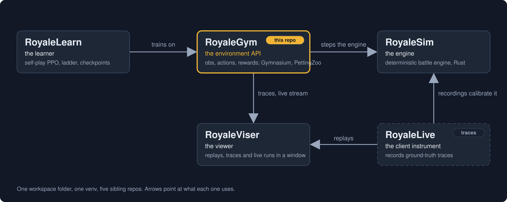</p>

You only need this repo and RoyaleSim to train a bot. The others are there when you want them: a
trainer and an add-on for it, a viewer, and the recordings the engine is calibrated against.
RoyaleGym is the front door, and the project is named after it.

The layout copies the one the Rocket League community settled on: a fast engine (RocketSim), an
environment API over it (RLGym), a trainer on top (RLGym-PPO) and a viewer beside them
(rlviser). Swap in RoyaleSim, RoyaleGym, RoyaleLearn and RoyaleViser and you have this project.

| Repo | What it is | To this repo |
|---|---|---|
| [RoyaleSim](https://github.com/RoyaleGym/RoyaleSim) | the battle engine. Integer-only Rust. The same seed always gives the same battle. Its movement rules are measured against recordings of real battles | the engine `RustEngine` drives, and where the arena and card data comes from |
| **RoyaleGym** (this repo) | the environment API: what the bot sees, what its moves mean, what it is rewarded for. Gymnasium, PettingZoo and self-play envs | package `royalegym`, which puts the five pieces together into the envs |
| [RoyaleLearn](https://github.com/RoyaleGym/RoyaleLearn) | the training harness: self-play rollouts, PPO, a ladder of frozen opponents, checkpoints | it runs on these envs. No bot has come out of it yet, and every run before the evening of 2026-09-22 trained on a mis-aligned reward. A fix landed that day and nothing has been published from a run on it |
| [RoyaleViser](https://github.com/RoyaleGym/RoyaleViser) | the viewer: recordings, engine traces and running environments, drawn in its own window | reads this package's recordings and its live UDP frames. The picture above is its window |
| [RoyaleImitate](https://github.com/RoyaleGym/RoyaleImitate) | an optional add-on to RoyaleLearn: config sections that start a bot from saved weights and keep it near a reference policy while it learns | it imports this package's fair observation fields and action numbering, and plugs into RoyaleLearn |
| RoyaleLive | records real matches. It is private | nothing directly. Its recordings are what RoyaleSim is calibrated against, so the accuracy reaches your envs through the engine |

Each layer only talks downward: RoyaleLearn to RoyaleGym to RoyaleSim. The engine knows
nothing about rewards or observations. This repo knows nothing about PPO. That means you can
change a reward without recompiling anything.

What comes in: the compiled engine module `royalesim`, and RoyaleSim's data files, which are
its table of calibrated constants and the arena and card tables built from it. This package
finds them at `../RoyaleSim/data`, or wherever `ROYALESIM_DATA_DIR` points. The engine itself
reads its card table from the checkout it was built in, as [Install](#install) explains.

What goes out: recordings (`.msgpack` or `.json`) for the viewer, the replay page and
regression tests; one UDP frame per env step for a viewer that is listening; and env objects
for the learner.

## Status

<p align="center">
  
  
  
  
</p>

**As of 2026-09-27.** Two things about what your clone gives you, and the second is the one to
read.

The install itself works from nothing. On 2026-09-27 the macOS and Linux form of the recipe, with
a Python 3.12 venv, was run from fresh clones on a 4-CPU Linux machine. `maturin develop
--release` took 163 seconds and about 1 GB of memory there. An earlier form of the recipe, from
before the card-table copy line was added, was run verbatim in Windows PowerShell 5.1 on
2026-09-22, and its release build took 119 seconds.

**The pytest suite passes on a clean runner: 1038 collected, 1028 passed, 9 skipped, 1 expected
failure, nothing failing.** This repo has one suite and it is pytest; there is no separate Rust
suite here, and the engine's own tests live in RoyaleSim. Measured at commit `ecbb80b` on a clean
runner rather than on the machine that wrote this: RoyaleGym suite run 36347317029 on GitHub's
Linux runner, on engine build `ec198b459cf311a4` built from RoyaleSim `1d661b0`, against the
15.535.29 card table. It took 8 minutes 38 seconds there. A count belongs to the commit and the
build it was taken at, so it names both.

**Expect the same nine skips on your machine** once the whole Install recipe is done. They are
worth reading rather than ignoring:

- Six comparisons between the compiled engine and `MockEngine`, the pure-Python stand-in. The
  stand-in reads the 2018 tables while the engine reads the current one, and running them across
  two vintages would measure the card data rather than the engines. Those six still run in
  RoyaleSim's cross-repo job, with both halves on one table.
- One statement that the two engines model a building's footprint differently: a circle in
  `MockEngine`, a box of whole tiles in the Rust engine.
- Two checks of a test count written in the docs: the badge above, and the one in
  `docs/architecture.md`. A count can only be checked at the commit it names, so anywhere else
  these skip and say so.

More tests skip if Node.js is not on your PATH, if RoyaleViser is not installed, if the other
repos are not next to this one, or if something on your machine already holds port 9870.

A skip that names what it wanted is information. Earlier in this repo's life some of these FAILED
instead, which is a different thing: a failure tells you your install is broken when it is not.

The `pytest` badge is from a clean runner, not the project's own machine, so it counts what a
fresh clone runs, including the six comparisons that skip on this install.

Working:

- The whole API on both engines. That is the Gymnasium, PettingZoo and self-play batched envs.
  The list of legal moves is worked out separately from the engine, and the tests check it
  against the engine's own ruling. They check every card the engine loads, including the Elixir
  Collector, which the deal keeps out of the opening hand. They check both seats and every move,
  on the whole-tile and the half-tile grid, on four boards: the opening, one with buildings
  down, one with a princess tower down, and one with both. Every card agrees on both card tables,
  and the tests allow no exception. Until 2026-09-27 one card did not: the list offered Heal on
  your own princess towers and on buildings, where the engine refused it.
- One bot can play both seats. Everything it sees is drawn from the acting player's point of
  view, with its own king at the bottom, so a battle turned 180 degrees looks the same to the
  other seat. The mirror of that does drift apart: 80 of 144 multi-unit deploys diverged
  ([`docs/architecture.md`](../docs/architecture.md)).
- Recording, verification, the replay page and the viewer stream. None of them are in the tick
  loop.
- Six scripted opponents to train against, from one that never plays a card to one that
  saves elixir before committing. `ladder()` returns them. Their order is a measurement,
  and what it measures is smaller than it looks: over a round robin of 40 games a pairing,
  only two orderings hold, and the three middle rungs cannot be told apart. That is
  written down in `royalegym/opponents.py` rather than smoothed over, because a ladder in
  the wrong order tells you a bot improved when it only moved to an easier opponent.
- An answer to "is this bot better than that one". `evaluate` plays the pair on both seats,
  half the games each way, and reports the win rate with a confidence interval, so a 55-45
  result over 100 games reads as "too close to call" rather than as a win. It also counts a
  battle the step limit cut short as unfinished rather than drawn, and reports the two seats
  separately, because a gap between them means part of what you measured was the colour.
- An observation that is fair by default. What your bot sees is what a person watching the
  match could write down, including a COUNT of the opponent's elixir that is exact against the
  engine's own bar. Anything hidden is opened one field at a time with a `Reveal`. Turning one
  on changes the observation's WIDTH instead of filling in zeroed slots, and
  `ClashParallelEnv.config()` records it, so a checkpoint says which `Reveal` fields were on
  ([`docs/observation-spec.md`](../docs/observation-spec.md)). One known gap: a unit invisible to
  its enemy, such as a Royal Ghost, is still shown to the enemy seat where it stands, which a
  player cannot see. This is not fixed yet, and `config()` cannot record it, because it is not a
  `Reveal`.
- The RLGym v2 names, so the vocabulary matches what you already know: `StateMutator`, and
  `TerminationCondition` / `TruncationCondition` so that a settled result and a time-out are
  different things. The earlier names still import as aliases.

**Speed: the Rust engine runs 1.16 to 1.38 times the pure-Python stand-in, measured by
alternating the two inside one process.** That ratio is the durable number here, because
whatever the machine is doing it does to both arms. An env step is one decision for each
player, covering half a second of game time.

The absolute rate is not durable and you should not plan against it. By 2026-09-22 the same
report on one laptop with 8 GB of memory had printed 953, 957, 859 and 1812 env steps per second,
depending on the hour and what else was running.

How that was measured, and the rest of the numbers:

- On 2026-09-21 the test suite's throughput report printed 826 env steps per second on the
  Rust engine at 10 ticks per step. The same report printed about 32 000 engine ticks per
  second when the engine is stepped 20 ticks at a time.
- The gap between those two figures is Python. Python builds both players' observations and
  their legal-move lists on every step. Closing that gap is the first open item below.
- Later the same day we dropped the placement-zone channels from the observation. The
  legal-move list already states that exactly, so the channels were saying it twice. The same
  report went from 766 to 953 env steps per second on the Rust engine, and from 475 to 580 on
  `MockEngine`.
- That was measured by alternating the two trees three times in one session. The absolute
  numbers move by a third depending on what else the machine is doing. The comparison between
  them does not.
- The same report on 2026-09-22, with five other jobs running on the machine, printed 957 env
  steps per second on the Rust engine.

Open, as of 2026-09-27:

- A unit invisible to its enemy, such as a Royal Ghost, is still shown to the enemy seat where it
  stands. A player cannot see it. This is not fixed yet.
- Leave the deck out and each side draws from every card the engine loads. That includes
  WarmSpell, an event card.
- Default observations and rewards should be computed inside the engine, with the Python
  versions kept as the override for experiments. Until that is done, training time goes to
  building observations rather than to the battle.
- RoyaleLearn runs on these envs, and no bot has come out of it yet. On 2026-09-22 its authors
  found that a reward reached the learner one step after the move that earned it, so every training
  number the project had produced described a different objective than the one intended. A fix
  landed the same day, and nothing has been published from a run on it. That is their side of the
  seam, not these envs, but it is the honest state of the only trainer that uses them. The envs also expose `action_masks()` in the form
  sb3-contrib's MaskablePPO expects, if you would rather bring your own trainer.
- `MockEngine` is a stand-in, not a second simulator. Spells resolve instantly, there are no
  stuns or knockbacks, and cards run at their base level. Anything about how faithful the game
  itself is belongs to RoyaleSim's status, not this repo's.

Tests:

```
cd RoyaleGym
..\.venv\Scripts\python -m pytest -q
..\.venv\Scripts\python -m ruff check royalegym tests examples
```

Without the engine built, the Rust-backed tests skip. An engine built from a different
calibration or arena file than the one on disk fails them instead of skipping.

The suite takes several minutes. On one desktop it takes about 10 to 12 minutes with nothing
else running, and 20 minutes or more beside other jobs.

With the whole Install recipe done, expect nine skips; the Status section above names them. A
few more skip if Node.js is not on your PATH or RoyaleViser is not installed. The summary at the
end of the run gives the reason for each skip. A skip is not a pass.
[Troubleshooting](../docs/site/pages/troubleshooting.md#6-tests-that-skip-instead-of-failing)
says which skips are expected and why.

Read next:

- [`examples/`](../examples/) for the seven numbered programs, starting with one battle and ending
  with comparing two bots, and the one measurement beside them.
- The documentation site, [royalegym.github.io/RoyaleGym](https://royalegym.github.io/RoyaleGym/),
  which is longer than anything here. The same pages are in this repo under
  [`docs/site/pages/`](../docs/site/pages/), and you can build the site yourself. It needs
  RoyaleViser and RoyaleLearn installed too, because its reference pages read their code. From
  the `Royale` folder, run `.venv\Scripts\python -m pip install -e "RoyaleGym[docs]"`. Then
  `cd RoyaleGym\docs\site`, run `..\..\..\.venv\Scripts\python collect.py --root ..\..\..` (it copies
  every repo's docs onto the site), then `..\..\..\.venv\Scripts\mkdocs serve`. On macOS and Linux
  those are `.venv/bin/python` and `../../../.venv/bin/mkdocs`. It serves the site at
  `http://127.0.0.1:8000/RoyaleGym/`. It first prints a boxed warning about MkDocs 2.0 from the
  theme's authors. That is a notice, not an error, and the build carries on.
  The published site is [royalegym.github.io/RoyaleGym](https://royalegym.github.io/RoyaleGym/): the
  [Quick Start](https://royalegym.github.io/RoyaleGym/quickstart/) trains a first bot, and there are pages on
  [installing](https://royalegym.github.io/RoyaleGym/install/),
  [writing a reward](https://royalegym.github.io/RoyaleGym/clash-royale/configuration-objects/reward-functions/),
  [observations](https://royalegym.github.io/RoyaleGym/clash-royale/configuration-objects/observation-builders/) and
  [actions](https://royalegym.github.io/RoyaleGym/clash-royale/configuration-objects/action-parsers/),
  [how accurate the engine is](https://royalegym.github.io/RoyaleGym/accuracy/) and
  [what to do when something breaks](https://royalegym.github.io/RoyaleGym/it-doesnt-work/).
- [`docs/architecture.md`](../docs/architecture.md) for the layers, the engine contract, the
  action space, the module map, and why each convention is there.
- [`docs/observation-spec.md`](../docs/observation-spec.md) for every channel and every vector
  slot, its range, and whether it is fair or a reveal.
- [`docs/background.md`](../docs/background.md) for what is publicly known about the game's rules,
  and why the engine is measured against recordings rather than reasoned out.
- Then the [RoyaleSim](https://github.com/RoyaleGym/RoyaleSim) and
  [RoyaleViser](https://github.com/RoyaleGym/RoyaleViser) READMEs.

## Community

The project's Discord is the front door for the whole family: bot creators, engine work and
training runs.

<p align="center">
  <a href="https://discord.gg/4D2BS5JBHP"></a>
</p>

Issues and pull requests on this repo are welcome too.
