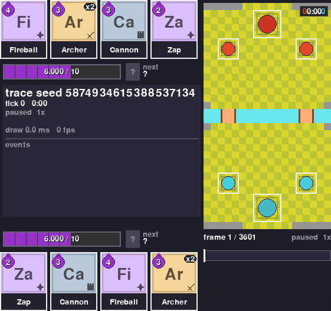

# Viewer

RoyaleViser shows a battle in a window: the arena, every unit, both hands and both elixir bars.
It's the easiest way to see what your bot actually does. It runs as its own program, so it
never slows training down, and when nobody is watching it costs almost nothing.

{ width="100%" }

It comes with the [install line](../../install.md#5-install-royalegym) and adds one command,
`royaleviser`.

## Watch Training Live

Turn on `viser=True` in the trainer:

```py
learner = Learner(build_env, viser=True, save_dir="runs/my_bot")
```

Then, while it trains, open the viewer in a second terminal:

```
royaleviser
```

It finds the training run on its own and follows one of its battles as it happens. Close it and
open it again whenever you like; training doesn't notice.

## Watch a Saved Battle

`play_battle` plays one battle and saves it to a file the viewer can open:

```python
from royalegym import make_env, play_battle

battle = play_battle(make_env(), blue="random", red="random", save_to="battle.msgpack")
print(battle.path)
```

```
battle.msgpack
```

```
royaleviser battle.msgpack
```

`blue` and `red` can each be `"random"`, `"noop"`, any [opponent](opponents.md), or a bot you
trained (`Learner.load_policy("runs/my_bot")`). To test your own bot on its own deck, pass your
`build_env()` instead of `make_env()`. `royaleviser battles/` opens the newest saved battle in a
folder you saved battles to. Don't point it at your `runs` folder: training doesn't save
battles, so it would open a training log.

## Keys

| Key | Does |
|---|---|
| Space | Play or pause. |
| Left / Right | Step one frame back or forward (with Shift: 20). |
| `+` / `-` | Faster or slower. |
| `f` | Flip the board to the other side's view. |
| `p` | Show where each unit is walking. |
| `t` | Show what each unit is attacking. |
| `g` | Show the tile grid. |
| Click | Pin a unit to see everything about it, or jump along the timeline. |
| `s` | Save a picture. |
| `h` | List every key. |
| `q` | Quit. |

## Compare Two Battles

Give the viewer a second file and it draws that battle on top of the first, as see-through
ghosts. Handy for seeing exactly where two versions of your bot made different choices:

```
royaleviser battle_a.msgpack --compare battle_b.msgpack
```

## Watching Without the Trainer

Any environment can stream to the viewer. Hand it a `ViserPublisher`. Only do this in your own
script that steps one environment, never in a `build_env` you train with `Learner`: the trainer
builds many environments, and only one can stream at a time. With the trainer, use
`viser=True` instead.

```py
from royalegym import ClashParallelEnv, RustEngine
from royalegym.viser import ViserPublisher

env = ClashParallelEnv(RustEngine(), viser=ViserPublisher())
```

Then run `royaleviser` and step the environment as usual. Only one program at a time can
stream, because the viewer listens on one fixed address.

The viewer's own guide, with every option, is in the
[RoyaleViser repository](https://github.com/RoyaleGym/RoyaleViser/blob/main/docs/guide.md).
