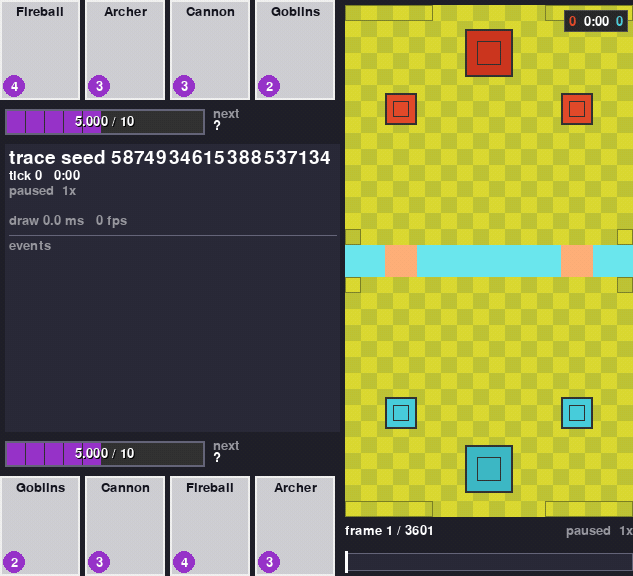

# Start here

  
  
  
  
  
  

**You write a reward function. This gives you everything else.**

A reward function is a short piece of Python that says what your bot should want. Taking a tower
is good. Losing one is bad. Everything around that already ships in the box: the battle itself,
what your bot sees, what its moves mean, how a match starts and when it ends. The battle runs in
a Rust engine that plays a whole three minute match in well under a second, so a laptop gets
through tens of thousands of matches an hour. You can watch any of them afterwards, in a viewer
window or in a single HTML file you double click.

There is nothing else in the loop. No phone, no copy of the game, no game files, nothing to wait
for over a network. You need Python and a compiler.

## Read this before you start

!!! warning "What works today, and what does not (22 September 2026)"

    **Working now.** The engine plays whole matches. The environments hand your bot what it sees,
    the exact list of moves it is allowed to make, and a reward. The viewer draws any of it.
    You can run all of that tonight.

    **New tonight, and not working yet on the real engine.** The training harness closed its
    loop on 2026-09-22. Its self-test config runs end to end, on the pure-Python stand-in
    engine for 96 timesteps. The profile you would actually train with clears every start-up
    gate and then stops in its first collection round on a known defect. So a loop exists, and
    nobody has trained a bot. Training also needs the torch extra, which the plain install
    does not pull in.

    So today this is a very fast Clash Royale sandbox with a standard bot interface on it. If you
    want to write your own training loop, or wire it into a library you already use, you can start
    now. If you wanted `train --config` to just work, wait a while, or come and ask in the
    [Discord](https://discord.gg/4D2BS5JBHP).

That is a whole battle, start to finish, played back in the viewer. Both players are picking at
random from the moves that are legal for them. Nothing was trained. That random player ships with
the environments, so you have something to play against from your first minute.

## What you can build with it

-   **A bot that plays a full match**

    ---

    Reset the environment, pick a move for each player, step, repeat until someone wins. One step
    is one decision for each player and covers half a second of game time, so a three minute match
    is 360 decisions each.

-   **Your own idea of what "good" means**

    ---

    Rewards are a Python class. So is what your bot sees, what its moves mean, how a match is set
    up, and when it ends. Each one has a default that ships, and each one is a few lines to
    replace.

-   **A lot of battles, on a normal computer**

    ---

    On a four core laptop with 8 GB of RAM: about 16,100 battles an hour on one worker process,
    about 65,200 on six. A run that needs a million battles is an overnight job, not a fortnight.

-   **Moves that are always legal**

    ---

    Every observation tells your bot which of the 2305 card and tile moves it can actually play
    right now. On the first step of a battle, 691 of the 2305 are. Your bot never wastes a
    decision on a card it cannot afford.

-   **A battle you can watch, not guess at**

    ---

    Any battle can be saved and reopened in the viewer, or turned into one self contained HTML
    file you double click. There is no server and nothing to install to read it.

-   **The same battle again, exactly**

    ---

    The same seed gives the same battle on any machine, because the engine does whole number
    arithmetic only. A recording carries a hash of the board for every tick, and a re run has to
    match all of them. A battle that went wrong once can be made to go wrong again.

!!! note "Two words you will see everywhere"

    A **tick** is the game's own 50 millisecond step. There are 20 ticks in a second of game time,
    and 3600 in a normal three minute match. An **env step** is one decision for each player, and
    by default it covers 10 ticks, so half a second.

## The four repos

The project is four public repositories that sit side by side in one folder. You install all four
in one go. Most of the time you only think about one of them.

| Repo | What it is | When you touch it |
|---|---|---|
| [RoyaleSim](https://github.com/RoyaleGym/RoyaleSim) | The battle engine, written in Rust. It plays the match: elixir, hands, deploys, walking, targeting, fighting, spells, towers, overtime and the crowns. | Once, to build it. After that only if you want to know how accurate it is, or you want to drive a battle directly from Python without an environment around it. |
| [RoyaleGym](https://github.com/RoyaleGym/RoyaleGym) | The environments. What your bot sees, what its moves mean, what it is rewarded for. It speaks Gymnasium and PettingZoo, the two standard Python interfaces for this. | Most of the time. Your reward function goes here, and this is the API your training code talks to. |
| [RoyaleLearn](https://github.com/RoyaleGym/RoyaleLearn) | The training harness: self play, PPO, a ladder of past opponents to measure against, checkpoints. | Not yet. It is being written. Install it now if you like, but nothing in it starts a training run. |
| [RoyaleViser](https://github.com/RoyaleGym/RoyaleViser) | The viewer. It opens a saved battle, an engine trace, or a training run that is happening right now, in its own window. | Whenever you want to see what your bot did instead of reading numbers off a table. It is optional and it needs no engine build. |

There is a fifth repository, RoyaleLive. It records real matches, it is private, and it always
will be. Its recordings are what the engine's movement and combat rules were measured against.
You never install it. Its accuracy reaches you through the engine.

Each layer only talks downwards. RoyaleLearn talks to RoyaleGym, which talks to RoyaleSim. The
engine knows nothing about rewards. That is why you can change a reward function without
recompiling anything.

## Three links

[Install](install.md){ .md-button .md-button--primary }
[Your first bot](first-bot.md){ .md-button }
[The Discord](https://discord.gg/4D2BS5JBHP){ .md-button }

Install sets up the four repos, one virtual environment and the engine build, and tells you
plainly which parts of that recipe have been run from a clean clone and which have not. Your
first bot is the shortest program that plays a whole match. The Discord is where you ask the
questions that are too small for an issue, which is most of them.
