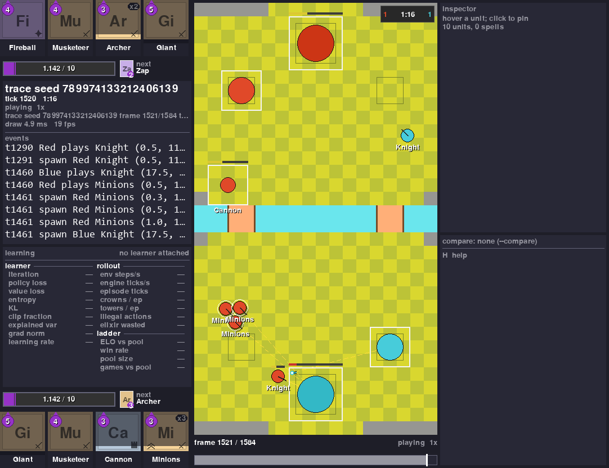

# Introduction

**RoyaleGym lets you make a Clash Royale bot on your own computer.** A bot learns in two ways.
It can copy people: it studies thousands of real games and learns to make the moves the players
made. That's called cloning. Or it can learn by trial and error: it plays practice battles,
thousands of them, and gets rewarded for what you choose.

Trial and error alone, starting from nothing, is slow, and it doesn't get a bot far. So for a bot
that plays like a person, plan to start by cloning.

{ width="100%" }

## Quick Answers

**Do I need the game or a phone?**
No. The battles run in RoyaleSim, a copy of the game's battle engine that runs on your computer.
You don't need the game, any game files, or an account.

**Can my bot play the real game for me?**
No. It trains in the simulator, and that's all it does.

**Can I get banned for this?**
RoyaleGym never touches the game, your account or Supercell's servers. There's nothing to ban.

**What computer do I need?**
Windows 10 or 11, Linux, or a Mac with Apple silicon (M1 or newer), with Python 3.12, and 16 GB
of memory. To train a bot you also want an NVIDIA graphics card (GTX 16-series, RTX
20-series or newer). Without one, everything still works, but training is too slow to be much
fun. The [FAQ](faq.md#what-computer-do-i-need) has the details.

**Do I need to know machine learning?**
No. If you can copy a file, run it, and change a line of Python, you can train a bot. The
[Quick Start](quickstart.md) walks you through it.

**How long until my bot is good?**
It depends on how it learns. A bot that starts from nothing and learns only by trial and error,
like the one in the [Quick Start](quickstart.md), learns to beat a bot that plays at random. On
one computer it seldom gets much further, even after days. To see a bot that plays like a person,
start by [cloning human players](clash-royale/cloning-a-bot.md). You can then train the clone
further by trial and error, but that's harder than it sounds, and it can make the bot worse: test
the new bot the same way you tested the clone, and compare.

**Is it free?**
Yes. It's open source, under the MIT license.

**Is it the real game?**
Close. The engine is checked against recordings of real battles, and most cards behave the same.
Some details are still being matched, so the engine keeps improving. Your bot's code won't need
to change when it does.

## What You'll Do

1. [Install it](install.md). About ten minutes, most of it waiting for downloads.
2. [Run the Quick Start](quickstart.md). One file that trains a bot from nothing, so you see how
   training works and what its numbers mean.
3. [Watch your bot play](quickstart.md#5-watch-it-play) in the viewer.
4. Change something, like [its deck](quickstart.md#8-use-your-own-deck) or
   [what it's rewarded for](quickstart.md#9-change-what-it-learns), and train again.
5. [Clone human players](clash-royale/cloning-a-bot.md). A bot that copies the moves people
   made in real games. This is where a bot that plays like a person starts.

Stuck? Look in the [FAQ](faq.md) and [It Doesn't Work](it-doesnt-work.md). Still stuck? Ask on
[Discord](https://discord.gg/we3z5SWdNj). Nobody minds beginner questions there.

## What's Inside

You install one thing, `royalegym[all]`, and it brings these along. In your own files you'll
mostly name three of them: RoyaleGym, RoyaleLearn and RoyaleImitate.

-   :material-gamepad-variant-outline:{ .lg .middle } **RoyaleGym**

    ---

    Sets up the battles: what your bot sees, what moves it can make, and what it's rewarded for.

-   :material-school-outline:{ .lg .middle } **[RoyaleLearn](resources/royalelearn.md)**

    ---

    The trainer. It runs the battles and teaches your bot.

-   :material-sword-cross:{ .lg .middle } **[RoyaleSim](resources/royalesim.md)**

    ---

    The battle engine. Elixir, cards, troops, spells, towers, overtime.

-   :material-eye-outline:{ .lg .middle } **[RoyaleViser](resources/royaleviser.md)**

    ---

    A window that shows a battle, so you can watch your bot.

-   :material-content-copy:{ .lg .middle } **[RoyaleImitate](resources/royaleimitate.md)**

    ---

    Clones a bot: it copies human players from real games, or another bot, so your bot
    starts out playing like them.

RoyaleGym is a fan project. It is not affiliated with, endorsed or sponsored by Supercell.
