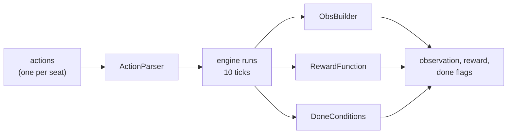

# How It Fits Together

**The short version:** `build_env()` in your quickstart file builds a battle out of a few small
pieces, one for each question about it: how does it start, what does the bot see, what can it
do, what is it paid for, and when is it over. To change how your bot trains, you swap one of
those pieces for another, or for one you write yourself.

You don't need this page to train your first bot. Read it when you want to change something the
[Quick Start](quickstart.md) doesn't cover.

These pieces are called **configuration objects**.

## Configuration Objects

| Object | The question it answers | Default |
|---|---|---|
| An **engine** | How does the battle play out? | `RustEngine`, the RoyaleSim engine |
| A [`StateMutator`](clash-royale/configuration-objects/state-mutators.md) | How does each battle start, and with which decks? | `DefaultStateMutator` |
| An [`ObsBuilder`](clash-royale/configuration-objects/observation-builders.md) | What does the bot see? | `SpatialObsBuilder` |
| An [`ActionParser`](clash-royale/configuration-objects/action-parsers.md) | What can the bot do, and which moves are legal right now? | `TileActionParser` |
| A [`RewardFunction`](clash-royale/configuration-objects/reward-functions.md) | What is the bot paid for? | `TowerHPReward` |
| Two [`DoneCondition`s](clash-royale/configuration-objects/done-conditions.md) | Is the battle over? Should it be cut short? | `GameOverCondition`, nothing |
| A [viewer](clash-royale/configuration-objects/viewer.md), optionally | Can I watch it? | none |

The engine is the only piece written in Rust. Everything else is plain Python, so you can
change a reward or an observation without building anything.

## Two Seats

Every battle has two players, called `"blue"` and `"red"`. They are the environment's two
**agents**, and both choose a move at the same time on every step. Who controls each seat is
up to you: your bot, a scripted [opponent](clash-royale/configuration-objects/opponents.md),
or your bot again, playing itself.

Each seat sees the arena from its own side, with its own king tower at the bottom, as you do
on your phone. So one bot can play either seat without knowing which one it is.

## One Step

One step of the environment is one decision. By default the bot decides every half second of
game time (`decision_ms=500`). The engine runs in ticks of 50 ms, so one step is 10 ticks, and
a normal three-minute battle is 360 steps.

On every step:



1. Each seat's action goes to the **action parser**, which turns it into a card play: which
   card, and where. A move that isn't legal right now is played as "wait".
2. The **engine** plays the battle forward by one step.
3. The **observation builder** makes what each seat sees next. It also hands over the
   **action mask**: which of the moves are legal right now.
4. The **reward function** scores the step for each seat.
5. The **done conditions** say whether the battle is over.

When a battle ends, the **state mutator** sets up the next one.

## Try It

To try the examples on this page, save each one as a file in your `royale` folder, for example
`try_it.py`, and run it with `python try_it.py`, the same way as the quickstart.

`make_env()` builds an environment with every default filled in. Here is what the bot sees and
what it can do:

```python
from royalegym import make_env

env = make_env()
obs, info = env.reset(seed=0)

print(env.agents)
print(env.action_space("blue"))
print(list(obs["blue"]))
```

```
['blue', 'red']
Discrete(2305)
['spatial', 'vector', 'action_mask', 'mask_planes']
```

The bot has 2305 moves to choose from: wait, or play one of the 4 cards in its hand on one of
the 18 x 32 tiles of the arena. `action_mask` marks which of them are legal right now.

And here is a whole battle, with both seats playing random legal moves:

```python
import numpy as np
from royalegym import make_env

env = make_env()
obs, info = env.reset(seed=0)
rng = np.random.default_rng(0)

done = False
while not done:
    actions = {}
    for agent in env.agents:
        legal = np.flatnonzero(obs[agent]["action_mask"])  # the legal moves
        actions[agent] = int(rng.choice(legal))
    obs, rewards, terminated, truncated, info = env.step(actions)
    done = terminated["blue"] or truncated["blue"]

print("Blue's crowns:", info["blue"]["own_crowns"], "Red's crowns:", info["blue"]["enemy_crowns"])
```

```text
Blue's crowns: 1 Red's crowns: 2
```

Your numbers may differ: the engine keeps improving, and a battle is a long chain of events.

## Building It Yourself

`make_env()` is a shortcut. The [Quick Start](quickstart.md)'s `build_env()` builds its
environment with every piece named instead, which is what you'll edit. Here is the same thing,
short:

```python
from royalegym import (
    ClashParallelEnv, CombinedReward, CrownReward, DefaultStateMutator, GameOverCondition,
    RustEngine, SpatialObsBuilder, TileActionParser, TowerHPReward, WinLossReward,
)

deck = ["Knight", "Archer", "Giant", "Minions", "Fireball", "Zap", "Cannon", "Musketeer"]
env = ClashParallelEnv(
    RustEngine(),
    state_mutator=DefaultStateMutator(decks=[deck, deck]),
    obs_builder=SpatialObsBuilder(),
    action_parser=TileActionParser(),
    reward_fn=CombinedReward([(WinLossReward(), 1.0), (CrownReward(), 0.2), (TowerHPReward(), 0.1)]),
    termination_cond=GameOverCondition(),
    truncation_cond=None,
    decision_ms=500,
)
print(env.action_space("blue"))
```

```
Discrete(2305)
```

Swap any one of these for another, or for one you write yourself, and the rest keeps working.
The pages under **Configuration Objects** show what each one does and how to write your own.
